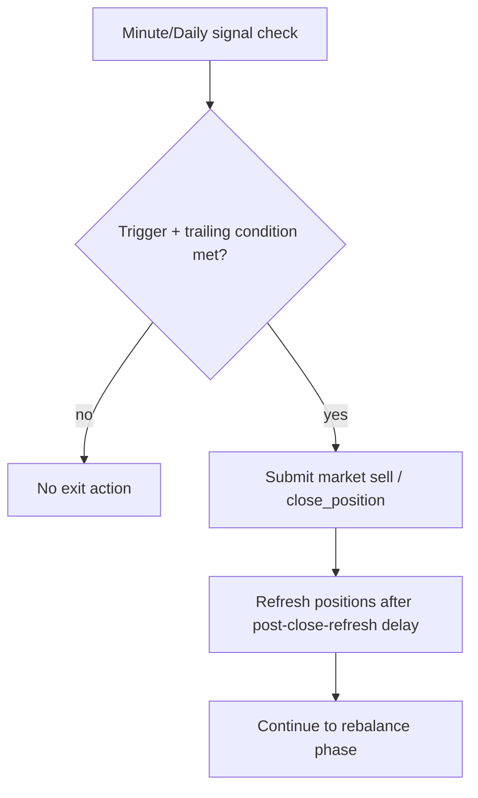
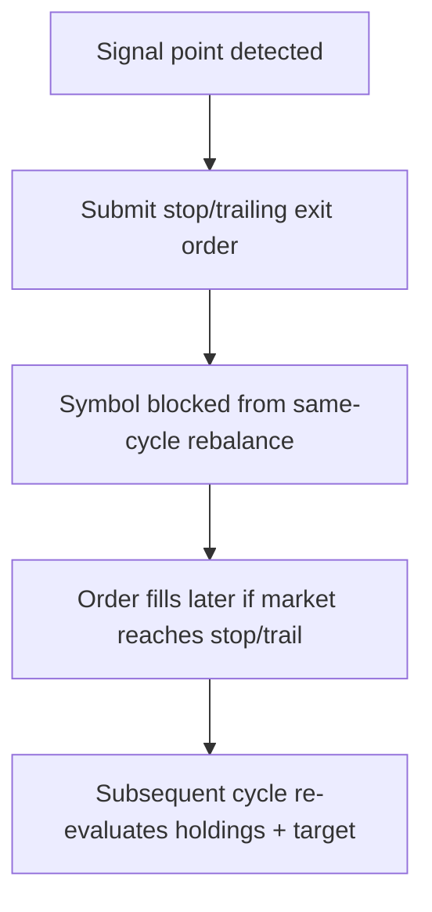
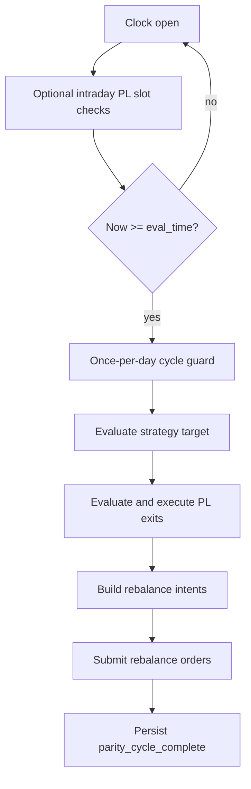
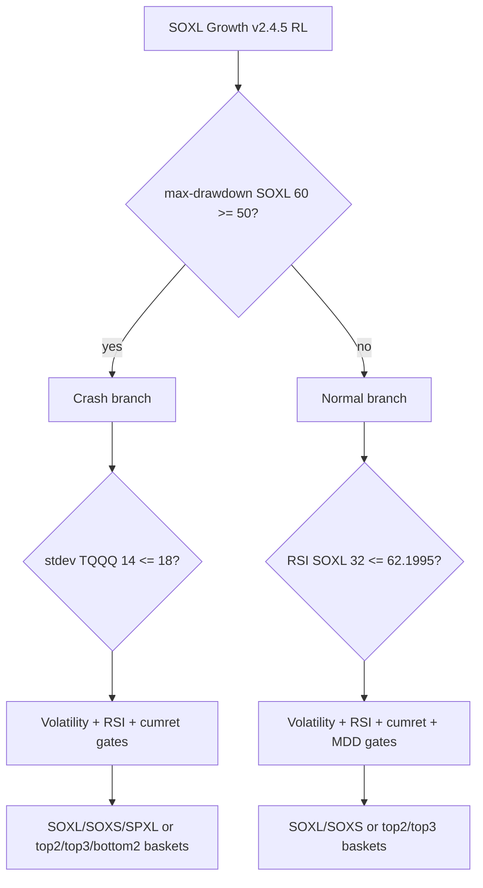

# AGGR Intraday-PL5M Paper-Live Parity Playbook

| Doc Meta | Value |
|---|---|
| Document ID | `AGGR_INTRADAY_PL5M_PAPER_LIVE_PARITY_PLAYBOOK` |
| Version | `v1.0.0-guidebook` |
| Last Updated (local) | `2026-03-21` |
| Primary Owner | Trading Compose Engineering |
| Strategy Baseline | `SOXL Growth v2.4.5 RL` |
| Locked Focus Profile | `aggr_adapt_t10_tr2_rv14_b85_m8_M30_intraday_pl_5m` |

## Quick Navigation

- [1) Scope and Purpose](#1-scope-and-purpose)
- [19) Runtime Inner Workings](#19-deep-inner-workings-runtime_backtest_parity_looppy)
- [20) Verifier Inner Workings](#20-deep-inner-workings-intraday_profit_lock_verificationpy)
- [36) Base Strategy Deep Dive](#36-base-strategy-deep-dive-soxl-growth-v245-rl)
- [41) Backtest Results Snapshot](#41-backtest-results-this-guide-configuration-point-in-time-snapshot)
- [44) Failure Recovery](#44-failure-recovery--restart-playbook)
- [58) Paper-to-Live Cutover Checklist](#58-paper-to-live-cutover-checklist)
- [60) Full Section Index](#60-full-section-index-1-69)
- [68) Sign-Off Page](#68-sign-off-page-template)
- [79) Release Checklist Template](#79-release-checklist-template)

## 1) Scope and Purpose

This document is a deep, implementation-grounded reference for this exact configuration:

- Profile: `aggr_adapt_t10_tr2_rv14_b85_m8_M30_intraday_pl_5m`
- Mode label (research/backtest context): `paper_live_parity`
- Profit-lock exec model: `--profit-lock-exec-model paper_live_style_optimistic`
- Runtime profit-lock order type: `market_order`

This guide is intended for technical review and external peer review. It explains:

1. What each setting means in code.
2. How strategy logic and execution logic interact.
3. Which script is for production live/paper execution vs. which script is for parity backtest/replay.
4. Exact command recipes and guardrails.

Code sources used in this document:

- `composer_original/tools/runtime_backtest_parity_loop.py`
- `composer_original/tools/intraday_profit_lock_verification.py`
- `composer_original/files/composer_original_file.txt`
- `soxl_growth/composer_port/symphony_soxl_growth_v245_rl.py` (strategy evaluator used by runtime/backtest tools)

---

## 2) Critical Clarification: Runtime vs Verifier

There are two different paths that are frequently confused:

### A) Production order execution path

- Script: `composer_original/tools/runtime_backtest_parity_loop.py`
- Uses real broker API calls when `--execute-orders` is set.
- Supports `--mode paper` and `--mode live`.
- Does not expose `--profit-lock-exec-model`.

### B) Paper-live parity backtest/replay path

- Script: `composer_original/tools/intraday_profit_lock_verification.py`
- Replays historical bars and emulates runtime-style behavior.
- Exposes `--profit-lock-exec-model`.
- Does not place real broker orders.

So, when you say:

`paper_live_parity + --profit-lock-exec-model paper_live_style_optimistic`

that is a verifier/backtest setting (path B), not direct production order-routing behavior.

---

## 3) Canonical Configuration Snapshot

For your requested setup:

| Item | Value |
|---|---|
| Strategy profile | `aggr_adapt_t10_tr2_rv14_b85_m8_M30_intraday_pl_5m` |
| Profile family | Aggressive adaptive trailing profit-lock |
| Intraday PL check cadence | 5 minutes |
| Profit-lock threshold base | 10% |
| Profit-lock trailing stop | 2% |
| Adaptive threshold | Enabled (`TQQQ`, RV window 14, baseline 85%, min 8%, max 30%) |
| Verifier exec model requested | `paper_live_style_optimistic` |
| Verifier exec model effective | `synthetic` |
| Runtime profit-lock order type | `market_order` |
| Typical data feed | `sip` |
| Rebalance frequency | Daily (strategy-level) |

---

## 4) Strategy Definition (from `composer_original_file.txt`)

The base strategy (`SOXL Growth v2.4.5 RL`) is a daily-rebalance decision tree with nested regime checks.

Top-level structure in `composer_original/files/composer_original_file.txt`:

- Asset class: `EQUITIES`
- Rebalance frequency: `daily`
- Main split:
  - If `max-drawdown(SOXL, 60) >= 50`: defensive/crash branch
  - Else: normal branch

It then applies nested conditions over:

- `stdev-return(...)`
- `rsi(...)`
- `cumulative-return(...)`
- `max-drawdown(...)`

and selects from instruments such as:

- Bull: `SOXL`, `TQQQ`, `SPXL`, `TMF`
- Bear/hedge: `SOXS`, `SQQQ`, `SPXS`, `TMV`

Selection operators include:

- `select-top` / `select-bottom`
- windows such as 3, 8, 14, 21, 30, 32, 60, 100, 105, 200, 250

The runtime and verifier do not redefine this strategy tree; they evaluate it and then apply profit-lock and execution behavior around that baseline allocation.

### 4.1 Complete top-level decision map (gate-by-gate)

The strategy is a nested binary tree.  
Below is the exact gate structure represented in `composer_original_file.txt` (and mirrored in `symphony_soxl_growth_v245_rl.py`).

| Gate ID | Condition | True branch | False branch |
|---|---|---|---|
| `G0` | `max-drawdown(SOXL,60) >= 50` | Crash regime (`C*`) | Normal regime (`N*`) |

#### Crash regime (`C*`) branch map

| Gate ID | Condition | True branch | False branch |
|---|---|---|---|
| `G1` | `stdev-return(TQQQ,14) <= 18` | `G2` | `G7` |
| `G2` | `stdev-return(TQQQ,100) <= 3.8` | `C_TOP2_GROWTH` | `G3` |
| `G3` | `rsi(TQQQ,30) >= 50` | `G4` | `G5` |
| `G4` | `stdev-return(TQQQ,30) >= 5.8` | `C_SOXS` | `C_SPXL` |
| `G5` | `cumulative-return(TQQQ,8) <= -20` | `C_SOXL` | `G6` |
| `G6` | `max-drawdown(TQQQ,200) <= 65` | `C_BOTTOM2_HEDGE` | `C_SOXL` |
| `G7` | `cumulative-return(TQQQ,30) <= -10` | `C_BOTTOM2_HEDGE` | `C_TOP3_GROWTH` |

Crash terminals:

| Terminal ID | Allocation primitive | Candidate set | Selection behavior |
|---|---|---|---|
| `C_SOXL` | `asset` | `SOXL` | 100% SOXL |
| `C_SOXS` | `asset` | `SOXS` | 100% SOXS |
| `C_SPXL` | `asset` | `SPXL` | 100% SPXL |
| `C_TOP2_GROWTH` | `filter + select-top 2` on `cumret(21)` | `SOXL,TQQQ,SPXL` | Equal-weight 2 winners |
| `C_BOTTOM2_HEDGE` | `filter + select-bottom 2` on `cumret(3)` | `TMV,SQQQ,SPXS,SPXS` | Equal-weight 2 losers (with duplicate `SPXS` in candidate list) |
| `C_TOP3_GROWTH` | `filter + select-top 3` on `cumret(21)` | `SOXL,TQQQ,TMF,SPXL` | Equal-weight 3 winners |

#### Normal regime (`N*`) branch map

| Gate ID | Condition | True branch | False branch |
|---|---|---|---|
| `G8` | `rsi(SOXL,32) <= 62.1995` | `G9` | `G14` |
| `G9` | `stdev-return(SOXL,105) <= 4.9226` | `N_SOXL` | `G10` |
| `G10` | `rsi(SOXL,30) >= 57.49` | `G11` | `G12` |
| `G11` | `stdev-return(SOXL,30) >= 5.4135` | `N_SOXS` | `N_TOP2_NORMAL` |
| `G12` | `cumulative-return(SOXL,32) <= -12` | `N_SOXL` | `G13` |
| `G13` | `max-drawdown(SOXL,250) <= 71` | `N_SOXS` | `N_SOXL` |
| `G14` | `rsi(SOXL,32) >= 50` | `N_SOXS` | `N_TOP3_GROWTH` |

Normal terminals:

| Terminal ID | Allocation primitive | Candidate set | Selection behavior |
|---|---|---|---|
| `N_SOXL` | `asset` | `SOXL` | 100% SOXL |
| `N_SOXS` | `asset` | `SOXS` | 100% SOXS |
| `N_TOP2_NORMAL` | `filter + select-top 2` on `cumret(21)` | `SOXL,SPXL,TQQQ` | Equal-weight 2 winners |
| `N_TOP3_GROWTH` | `filter + select-top 3` on `cumret(21)` | `SOXL,TQQQ,TMF,SPXL` | Equal-weight 3 winners |

### 4.2 Strategy “layers” inside the top-level tree

| Layer | What it is doing | Indicators used |
|---|---|---|
| Regime detection | Split into crash vs normal environment | `max-drawdown(SOXL,60)` |
| Volatility gating | Adjust aggression/defensiveness based on realized vol | `stdev-return(TQQQ,14/30/100)`, `stdev-return(SOXL,30/105)` |
| Momentum/trend gating | Directional confirmation/reversal filters | `rsi(TQQQ,30)`, `rsi(SOXL,30/32)`, `cumulative-return(...)` |
| Risk override | Additional drawdown-based switches to bear/bull posture | `max-drawdown(TQQQ,200)`, `max-drawdown(SOXL,250)` |
| Portfolio selection | Choose single asset or k-of-n baskets | `asset`, `select-top`, `select-bottom`, `weight-equal` |

### 4.3 Exact indicator windows and thresholds at top level

| Symbol | Indicator | Window | Threshold(s) used |
|---|---|---:|---|
| SOXL | max drawdown | 60 | `>= 50` (regime split) |
| TQQQ | stdev return | 14 | `<= 18` |
| TQQQ | stdev return | 100 | `<= 3.8` |
| TQQQ | RSI | 30 | `>= 50` |
| TQQQ | stdev return | 30 | `>= 5.8` |
| TQQQ | cumulative return | 8 | `<= -20` |
| TQQQ | max drawdown | 200 | `<= 65` |
| TQQQ | cumulative return | 30 | `<= -10` |
| SOXL | RSI | 32 | `<= 62.1995` and `>= 50` |
| SOXL | stdev return | 105 | `<= 4.9226` |
| SOXL | RSI | 30 | `>= 57.49` |
| SOXL | stdev return | 30 | `>= 5.4135` |
| SOXL | cumulative return | 32 | `<= -12` |
| SOXL | max drawdown | 250 | `<= 71` |

### 4.4 How `weight-equal` impacts top-level structure

`weight-equal` wrappers appear throughout the DSL:

1. Around branch outputs to normalize branch-selected leaves.
2. Around `filter/select` outputs so winners are equally weighted.
3. Around nested single-asset terminals (effectively still 100% single asset).

In practice, top-level branch outputs resolve to either:

- a concentrated 100% single instrument exposure, or
- an equal-weight basket from selected winners/losers.

### 4.5 Top-level invariants reviewers should validate

For structural integrity checks of `composer_original_file.txt`, verify:

1. Regime split remains `max-drawdown(SOXL,60) >= 50`.
2. Crash branch volatility gate remains `stdev-return(TQQQ,14) <= 18`.
3. Normal branch primary gate remains `rsi(SOXL,32) <= 62.1995`.
4. Hedge basket still uses `select-bottom 2` over `TMV,SQQQ,SPXS,SPXS`.
5. Growth basket still uses `select-top 3` over `SOXL,TQQQ,TMF,SPXL`.
6. No indicator threshold/window drift from values listed above.

---

## 5) Locked Profile Surface (All Available Profiles)

Defined in `runtime_backtest_parity_loop.py`:

| Profile | Profit Lock | Base Threshold | Trail | Adaptive | Intraday PL Cadence |
|---|---:|---:|---:|---:|---:|
| `original_composer` | Off | 15% | 5% | Off | 0 min |
| `trailing12_4_adapt` | On | 12% | 4% | On | 0 min |
| `aggr_adapt_t10_tr2_rv14_b85_m8_M30` | On | 10% | 2% | On | 0 min |
| `aggr_adapt_t10_tr2_rv14_b85_m8_M30_intraday_pl_5m` | On | 10% | 2% | On | 5 min |

Only difference between the two aggr profiles:

- `intraday_profit_lock_check_minutes = 5` for `_intraday_pl_5m`
- all other lock parameters are the same.

---

## 6) Mode Surface (What “Mode” Means in Each Tool)

### Runtime loop (`runtime_backtest_parity_loop.py`)

| Flag | Values | Meaning |
|---|---|---|
| `--mode` | `paper`, `live` | Which Alpaca trading environment to hit |
| `--execute-orders` | present/absent | Real submit vs dry-run cycle |

### Intraday verifier (`intraday_profit_lock_verification.py`)

| Flag | Values | Meaning |
|---|---|---|
| `--mode` | `paper`, `live` | Credential routing for historical data pull context |
| `--profit-lock-exec-model` | `paper_live_style_optimistic`, `synthetic`, `market_close` | Fill model used in replay |

Important:

- In verifier outputs, requested `paper_live_style_optimistic` is mapped to effective `synthetic`.

---

## 7) Profit-Lock Exec Models (Verifier Path)

From verifier code:

| Requested | Effective | Behavior |
|---|---|---|
| `paper_live_style_optimistic` | `synthetic` | Fill at modeled trigger/trailing level (with slippage), not forced close fill |
| `synthetic` | `synthetic` | Same as above |
| `market_close` | `market_close` | Uses close-based fill in relevant branch |

This is a replay model choice, not direct broker order-book reality.

---

## 8) Order Type Surface

There are two order-type domains:

### A) Profit-lock exit order type

Available in both runtime and verifier emulation:

- `close_position`
- `market_order`
- `stop_order`
- `trailing_stop`

Semantics:

| Type | Runtime behavior | Verifier behavior |
|---|---|---|
| `close_position` | Broker close-position call | Immediate modeled close at signal |
| `market_order` | Broker market sell | Immediate modeled close at signal |
| `stop_order` | Submit stop sell with cap logic | Resting modeled stop after signal; can delay fill |
| `trailing_stop` | Submit broker trailing stop | Resting modeled trailing stop after signal |

### B) Rebalance order type (runtime only)

Available:

- `market`
- `bracket` (for buy intents; sells remain market)

Bracket parameters:

- `--bracket-take-profit-pct` (default 12)
- `--bracket-stop-loss-pct` (default 6)

---

## 9) Exact Behavior of Your Requested Profile

Configuration:

- profile: `aggr_adapt_t10_tr2_rv14_b85_m8_M30_intraday_pl_5m`
- order type: `market_order`
- verifier exec model: `paper_live_style_optimistic` (effective synthetic)

### 9.1 Threshold math

Daily threshold starts with base 10%.
If adaptive enabled:

1. Compute realized volatility on prior close history of adaptive symbol (`TQQQ`) over 14-day window.
2. Compute ratio `rv / baseline` where baseline is 85%.
3. Scale base threshold by that ratio.
4. Clamp into `[8%, 30%]`.

### 9.2 Trigger + trailing math

For held symbol:

1. `trigger_price = prev_close * (1 + threshold_pct)`
2. If `day_high >= trigger_price`, profit-lock is armed.
3. Trailing stop level = `day_high * (1 - 0.02)`.
4. If current close/price condition satisfies stop rule, exit is triggered.

### 9.3 Intraday cadence effect (`_intraday_pl_5m`)

In runtime loop:

- Intraday checks occur on 5-minute slots before `--eval-time`.
- Slot dedupe is enforced per trading day (`intraday_profit_lock_last_slot` key).
- If signal occurs and `--execute-orders` is enabled, exit order is submitted immediately in that slot.

At/after eval time:

- Daily parity cycle runs once:
  - recompute baseline target
  - evaluate profit-lock again
  - then rebalance intents (sell-first logic)

### 9.4 Rebalance interaction

- Profit-lock exits are processed first.
- Rebalance intents are built after exits.
- If using `stop_order` or `trailing_stop` for exits, symbols can be blocked from same-cycle rebalance.
- With `market_order`, no resting-order block behavior is applied.

---

## 10) “paper_live_parity” Meaning in Practice

In current workspace usage, `paper_live_parity` is a naming convention for runtime-style parity backtests and reports, typically indicating:

- runtime-like sequencing,
- parity-focused replay outputs,
- CPU/GPU consistency checks.

It is not a single dedicated CLI flag in `runtime_backtest_parity_loop.py`.

Operationally:

- Runtime paper/live parity execution path: `runtime_backtest_parity_loop.py`
- Runtime-style replay/parity backtest path: `intraday_profit_lock_verification.py`

---

## 11) Daily-Synthetic Parity Switches (Verifier)

When `--daily-synthetic-parity` is enabled:

- trigger model: `daily_high_close`
- rebalance price model: `adjusted_daily_close`
- rebalance threshold: `0.0`
- minute-bar intraday path: disabled

Split behavior now supports override:

- strict parity default: split adjustment disabled
- optional override:
  - `--daily-synthetic-parity-split-adjustment`
  - enables split ratio scaling even while daily-synthetic parity is on

This override is parity-like experimentation, not strict daily-synthetic parity.

---

## 12) Production Commands (Paper/Live)

### 12.1 Paper dry-run (no order submit)

```bash
composer_original/.venv/bin/python composer_original/tools/runtime_backtest_parity_loop.py \
  --env-file /home/chewy/projects/trading-compose-dev/.env.dev \
  --env-override \
  --mode paper \
  --strategy-profile aggr_adapt_t10_tr2_rv14_b85_m8_M30_intraday_pl_5m \
  --data-feed sip \
  --eval-time 15:55 \
  --profit-lock-order-type market_order \
  --rebalance-order-type market
```

### 12.2 Paper execution (submits orders)

```bash
composer_original/.venv/bin/python composer_original/tools/runtime_backtest_parity_loop.py \
  --env-file /home/chewy/projects/trading-compose-dev/.env.dev \
  --env-override \
  --mode paper \
  --strategy-profile aggr_adapt_t10_tr2_rv14_b85_m8_M30_intraday_pl_5m \
  --data-feed sip \
  --eval-time 15:55 \
  --profit-lock-order-type market_order \
  --rebalance-order-type market \
  --execute-orders
```

### 12.3 Live execution (real money)

```bash
composer_original/.venv/bin/python composer_original/tools/runtime_backtest_parity_loop.py \
  --env-file /home/chewy/projects/trading-compose-dev/.env.dev \
  --env-override \
  --mode live \
  --strategy-profile aggr_adapt_t10_tr2_rv14_b85_m8_M30_intraday_pl_5m \
  --data-feed sip \
  --eval-time 15:55 \
  --profit-lock-order-type market_order \
  --rebalance-order-type market \
  --execute-orders
```

---

## 13) Research/Parity Backtest Commands (Verifier)

### 13.1 Requested setup (paper_live_parity style replay)

```bash
composer_original/.venv/bin/python composer_original/tools/intraday_profit_lock_verification.py \
  --env-file /home/chewy/projects/trading-compose-dev/.env.dev \
  --env-override \
  --mode paper \
  --strategy-profile aggr_adapt_t10_tr2_rv14_b85_m8_M30_intraday_pl_5m \
  --profit-lock-exec-model paper_live_style_optimistic \
  --runtime-profit-lock-order-type market_order \
  --initial-principal 10000 \
  --initial-equity 10000 \
  --start-date 2025-12-21 \
  --end-date 2026-03-21 \
  --output-prefix intraday_pl5m_paper_live_opt_3m
```

### 13.2 Strict daily-synthetic parity

```bash
composer_original/.venv/bin/python composer_original/tools/intraday_profit_lock_verification.py \
  --env-file /home/chewy/projects/trading-compose-dev/.env.dev \
  --env-override \
  --mode paper \
  --strategy-profile aggr_adapt_t10_tr2_rv14_b85_m8_M30_intraday_pl_5m \
  --profit-lock-exec-model synthetic \
  --daily-synthetic-parity \
  --no-daily-synthetic-parity-split-adjustment \
  --runtime-profit-lock-order-type market_order \
  --start-date 2025-12-21 \
  --end-date 2026-03-21
```

### 13.3 Daily-synthetic parity with split override ON

```bash
composer_original/.venv/bin/python composer_original/tools/intraday_profit_lock_verification.py \
  --env-file /home/chewy/projects/trading-compose-dev/.env.dev \
  --env-override \
  --mode paper \
  --strategy-profile aggr_adapt_t10_tr2_rv14_b85_m8_M30_intraday_pl_5m \
  --profit-lock-exec-model synthetic \
  --daily-synthetic-parity \
  --daily-synthetic-parity-split-adjustment \
  --runtime-profit-lock-order-type market_order \
  --start-date 2025-12-21 \
  --end-date 2026-03-21
```

---

## 14) End-to-End Daily Lifecycle (Runtime Path)

1. Load env and resolve Alpaca config.
2. Read market clock.
3. If market closed: sleep and retry.
4. For intraday profile (`_intraday_pl_5m`):
   - run slot checks every 5 minutes before eval time,
   - compute adaptive threshold from daily bars,
   - compute day highs/current prices from minute bars,
   - generate profit-lock signals,
   - submit exit orders (`market_order` here) if enabled.
5. At/after eval time once per day:
   - recompute baseline target weights,
   - reevaluate profit-lock,
   - submit exits,
   - compute rebalance intents,
   - submit rebalance orders.
6. Persist state (`parity_executed_day`, events, targets).

---

## 15) Differences You Should Expect: Verifier vs Live/Paper Runtime

Even with same profile and order-type labels, live/paper realized results can diverge from parity backtest results due to:

1. Real fill dynamics (queue, spread, partials, price improvement/worsening).
2. Data timing/staleness at decision point.
3. Broker order lifecycle and asynchronous execution.
4. Market microstructure not represented by deterministic replay assumptions.

So the verifier is best treated as:

- a reproducible reference path,
- a behavior regression tool,
- a parity-style benchmark,

not as an exact forward predictor of broker-realized fills.

---

## 16) Artifacts Produced by Each Path

### Runtime loop

- state DB (default): `composer_original_parity_runtime.db`
- logged events:
  - `parity_profit_lock_intraday_close`
  - `parity_profit_lock_close`
  - `parity_rebalance_order`
  - `parity_cycle_complete`

### Verifier

- summary JSON (metrics + config echo)
- daily CSV (day-by-day equity, pnl, drawdown, actions)
- full event list in summary JSON

---

## 17) Safety / Ops Checklist Before Production

1. Confirm `.env.dev` has valid keys:
   - `ALPACA_API_KEY`
   - `ALPACA_SECRET_KEY`
2. Confirm intended data feed (`sip` vs `iex`).
3. Start in paper mode with `--execute-orders`.
4. Verify event stream in state DB/logs for one full session.
5. Validate order quantities and symbol transitions.
6. Confirm no unintended bracket behavior if you intend market-only.
7. Promote to `--mode live` only after paper validation.

---

## 18) Triple-Check Review Notes (for peer review)

This document was reviewed against current code for:

1. Profile constants and parser surfaces.
2. Runtime order-type and rebalance behavior.
3. Verifier exec-model semantics and parity/split flags.

If you want a strict audit version, next step is to attach:

- exact commit hash,
- exact command history used for your latest result tables,
- artifact manifest linking each table row to its summary JSON path.

---

## 19) Deep Inner Workings: `runtime_backtest_parity_loop.py`

This is the production scheduler/executor path for paper/live trading.

### 19.1 Primary role in architecture

| Layer | Responsibility |
|---|---|
| CLI/ops | Parse runtime flags, load env, choose mode/profile/order styles |
| Broker loop | Run continuously while process is alive |
| Data layer | Pull daily adjusted bars and intraday raw minute bars from Alpaca |
| Decision layer | Evaluate strategy target weights + profit-lock signals |
| Execution layer | Submit close/market/stop/trailing exits, then rebalance orders |
| Persistence | Write cycle state/events into state DB |

### 19.2 Core data contracts

| Object | Key fields | Meaning |
|---|---|---|
| `StrategyProfile` | `enable_profit_lock`, `profit_lock_mode`, threshold/trail/adaptive knobs, `intraday_profit_lock_check_minutes` | Locked profile definition |
| `ProfitLockSignal` | `symbol`, `qty`, `trigger_price`, `trail_stop_price`, `last_price` | Fully-evaluated exit intent prior to execution |
| `PROFILES` | 4 named profiles | Immutable profile surface used by runtime and verifier |

### 19.3 Startup sequence

1. Optional safe `.env` load via `_load_env_file` (literal parser, no shell eval).
2. Resolve profile from `PROFILES`.
3. Build `AlpacaConfig` from env + `--mode` + `--data-feed`.
4. Initialize:
   - `StateStore` for runtime state and event log
   - `AlpacaBroker` for execution and account/clock/calendar calls
   - `AlpacaBarLoader` for OHLC/minute bars
5. Load `StrategyConfig()` and symbol universe.
6. Parse `--eval-time` (`HH:MM`) once.
7. Enter infinite runtime loop.

### 19.4 Time/state machine inside `_run_loop`

Per loop iteration:

1. Read broker clock.
2. If market closed: sleep (`--loop-sleep-seconds`) and continue.
3. Compute NY day/time and session open/close window from calendar fallback.
4. Optional intraday PL stage:
   - enabled only when profile has `intraday_profit_lock_check_minutes > 0`
   - active only before eval time
   - deduped by slot key `YYYY-MM-DD:slot_idx` in state DB
5. Daily eval stage:
   - execute only when `current_time >= eval_time`
   - execute only once per day (`parity_executed_day` guard)
6. Write summary event and sleep.

State keys used:

| Key | Purpose |
|---|---|
| `intraday_profit_lock_last_slot` | Prevent duplicate intraday slot execution |
| `parity_executed_day` | Enforce at-most-once daily cycle |
| `parity_last_profile` | Last executed profile name |
| `parity_last_target` | Last baseline target weights snapshot |

### 19.5 Data loading mechanics

| Function | Timeframe | Adjustment | Use |
|---|---|---|---|
| `_fetch_daily_ohlc` | `1Day` | `all` | Prior-close and adaptive threshold context |
| `_fetch_intraday_day_stats` | `1Min` | `raw` | Day-high and current/last intraday close |

Staleness control:

- Compute freshest minute timestamp across symbols.
- If stale minutes exceed `--stale-data-threshold-minutes`, skip cycle for safety.

### 19.6 Adaptive threshold math

`_current_threshold_pct`:

1. Start from profile base threshold.
2. If adaptive disabled: return base.
3. Pull prior closes for adaptive symbol (`TQQQ`).
4. Compute annualized realized volatility over configured window.
5. Scale threshold by `rv / baseline`.
6. Clamp to `[min_threshold, max_threshold]`.

Formula:

- `threshold = clamp(base * (rv / baseline), min, max)`

### 19.7 Profit-lock signal generation

`_build_profit_lock_signals` checks each long position:

1. `prev_close` from daily history.
2. `trigger_price = prev_close * (1 + threshold_pct/100)`.
3. Require `day_high >= trigger_price` (arm condition).
4. For trailing mode:
   - `trail_stop_price = day_high * (1 - trail_pct/100)`
   - close only if `last_price <= trail_stop_price`
5. Emit `ProfitLockSignal` for symbols to exit.

### 19.8 Exit order execution mapping

`_submit_profit_lock_signals`:

| `--profit-lock-order-type` | Runtime action |
|---|---|
| `close_position` | Broker close-position endpoint |
| `market_order` | Submit explicit market sell qty |
| `stop_order` | Submit sell stop at capped stop price |
| `trailing_stop` | Submit trailing stop sell with trail percent |

Important stop cap logic:

- For stop sells, stop is capped below current last price using
  `--stop-price-offset-bps` to avoid invalid stop-above-market behavior.

### 19.9 Rebalance construction/execution

1. Read account equity + current holdings.
2. Build intents with `build_rebalance_order_intents(...)` using:
   - target weights from `evaluate_strategy(...)`
   - last prices from intraday stats
   - minimum trade delta from `StrategyConfig().rebalance_threshold`
3. If profit-lock order type is resting (`stop_order`/`trailing_stop`), block same-cycle re-entry on closed symbols.
4. Execute intents:
   - default market
   - or bracket for buys when `--rebalance-order-type bracket`

### 19.10 Events emitted

| Event | Trigger |
|---|---|
| `parity_profit_lock_intraday_close` | Intraday slot exit submit |
| `parity_profit_lock_close` | Eval-time exit submit |
| `parity_rebalance_order` | Each rebalance order submit |
| `parity_cycle_complete` | End of daily cycle summary |

---

## 20) Deep Inner Workings: `intraday_profit_lock_verification.py`

This is the historical replay/verifier path, not live order routing.

### 20.1 Primary role in architecture

| Layer | Responsibility |
|---|---|
| Replay engine | Simulate day-by-day holdings/equity using historical bars |
| Parity controls | Emulate runtime-like order behavior and optional daily synthetic parity |
| Profile integrity | Dynamically import runtime `PROFILES` to avoid drift |
| Reporting | Emit JSON summary + daily CSV + event stream |

### 20.2 Profile source of truth

`_load_runtime_profiles()` imports `runtime_backtest_parity_loop.py` and copies `PROFILES` into local `LockedProfile` objects.  
This prevents silent divergence between runtime profile constants and verifier profile constants.

### 20.3 Data pipeline

1. Pull daily adjusted OHLC (`adjustment=all`).
2. Pull daily raw OHLC (`adjustment=raw`) for split factor math.
3. Align symbols to intersection of common daily dates.
4. Build `price_history` from aligned adjusted closes.
5. Optionally pull minute raw bars for intraday replay (disabled under daily-synthetic parity).
6. Build baseline target allocations from backtest engine:
   - `run_backtest(..., evaluate_fn=evaluate_strategy)`
   - consumes allocation path, not its own PnL.

### 20.4 Split-adjustment model

`_build_split_ratio_by_day_symbol` computes day-start share scaling ratio:

- `ratio(D) = (adj/raw on D) / (adj/raw on D-1)`

Then in simulation loop, holdings are multiplied by this ratio at day start.

Daily synthetic parity interaction:

- strict parity: split adjustment off
- override: `--daily-synthetic-parity-split-adjustment` keeps split scaling on while parity is enabled

### 20.5 Simulation core (`_simulate_intraday_verification`)

Per day:

1. Apply split scaling (if enabled).
2. Compute adaptive threshold for the day from prior closes only.
3. Profit-lock phase:
   - branch A: daily-synthetic parity logic (`day_high`, `day_close`)
   - branch B: minute replay logic (`minute high/low/close` traversal)
4. Rebalance phase:
   - derive last prices (daily close in parity mode, minute last close otherwise)
   - build intents via `build_rebalance_order_intents`
   - apply sell then buy with slippage/fees
5. Update equity path, drawdown stats, daily row records.

### 20.6 Exec model semantics

Parser allows:

- `paper_live_style_optimistic`
- `synthetic`
- `market_close`

Current implementation maps:

- requested `paper_live_style_optimistic` to effective `synthetic`

In summary JSON both requested and effective values are emitted explicitly.

### 20.7 Runtime order-type emulation in minute path

`--runtime-profit-lock-order-type` controls modeled post-signal behavior:

| Type | Verifier emulation |
|---|---|
| `close_position`, `market_order` | Immediate modeled exit at signal semantics |
| `stop_order` | Submit modeled stop, wait for later minute low breach |
| `trailing_stop` | Submit modeled trailing stop, wait for later breach |

For resting types, symbols are blocked from same-day rebalance re-entry after signal submission.

Scope note:

- This runtime-order-type emulation applies to the minute replay branch.
- Under `--daily-synthetic-parity`, minute replay is disabled, so exits follow daily synthetic trigger/close mechanics instead of minute resting-order mechanics.

### 20.8 Daily synthetic parity switch set

When parity is on:

- trigger model becomes `daily_high_close`
- rebalance pricing becomes `adjusted_daily_close`
- rebalance threshold forced to `0.0`
- minute pull/replay disabled

This is intentionally closer to daily synthetic style and away from intraday realism.

### 20.9 CPU/GPU path

The tool runs the same simulation function twice:

- CPU result
- GPU result (currently Cupy detection only; simulation logic still CPU-style deterministic path)

Outputs include parity diff bps between CPU and GPU final equity.

### 20.10 Output artifacts

| File | Content |
|---|---|
| `*_daily.csv` | Day-by-day CPU/GPU equity, pnl, return, drawdown, actions |
| `*.json` summary | Config echo, metrics, parity stats, daily rows, full event records |

---

## 21) Deep Inner Workings: `composer_original_file.txt`

This file is the DSL source of the original Composer strategy logic.

### 21.1 Strategy envelope

| Field | Value |
|---|---|
| Symphony name | `SOXL Growth v2.4.5 RL` |
| Asset class | `EQUITIES` |
| Rebalance frequency | `daily` |

### 21.2 DSL primitives used

| Primitive | Meaning |
|---|---|
| `if` | Conditional branching |
| `asset` | Leaf instrument selection |
| `weight-equal` | Equal-weight combine selected leaves |
| `filter + select-top` | Momentum-style selection of strongest assets |
| `filter + select-bottom` | Contrarian/hedge selection of weakest assets |
| `rsi`, `stdev-return`, `cumulative-return`, `max-drawdown` | Indicator gates |

### 21.3 High-level regime split

Top gate:

- If `max-drawdown(SOXL, 60) >= 50`: crash/defensive branch
- Else: normal branch

### 21.4 Crash branch behavior (simplified)

Primary conditions are based on TQQQ volatility and trend:

- `stdev-return(TQQQ,14) <= 18` sub-branch:
  - very low long vol condition uses top-2 growth selection among `SOXL/TQQQ/SPXL`
  - otherwise branches to RSI and short-horizon stress checks
  - includes bearish allocations (`SOXS`, `SQQQ`, `SPXS`, `TMV`) when stress flags trip
- `stdev-return(TQQQ,14) > 18` sub-branch:
  - if 30-day TQQQ return very weak, select bottom-2 hedge basket
  - else select top-3 growth basket (`SOXL/TQQQ/TMF/SPXL`)

### 21.5 Normal branch behavior (simplified)

Primary gate:

- `RSI(SOXL,32) <= 62.1995` versus `> 62.1995`

Within normal branch:

- low long-horizon SOXL volatility can hold `SOXL`
- rising short-horizon volatility can flip to `SOXS`
- otherwise use top-2/top-3 growth filters
- drawdown and cumulative return checks alter SOXL/SOXS bias

### 21.6 Asset universe implied by DSL

- Long growth: `SOXL`, `TQQQ`, `SPXL`, `TMF`
- Bear/hedge: `SOXS`, `SQQQ`, `SPXS`, `TMV`

Note:

- `SPXS` appears twice in bottom-hedge lists. In equal weighting/select operations this can materially bias allocation toward that symbol depending on evaluator semantics.

### 21.7 What is not in this file

- No broker order type semantics.
- No intraday profit-lock cadence.
- No slippage/fee/fill model.
- No runtime schedule (`eval-time`, loop sleep, stale checks).

Those are layered later by runtime/verifier tooling.

---

## 22) Deep Inner Workings: `symphony_soxl_growth_v245_rl.py`

This is the Python evaluator implementation of the Composer DSL tree.

### 22.1 Role

| Function | Role |
|---|---|
| `build_tree(...)` | Build executable decision tree from node objects |
| `evaluate_strategy(ctx, tree=None)` | Evaluate active tree on context and return target weights |
| `build_smoothed_rsi_tree(...)` | Optional RSI-smoothed variant for sweeps |

### 22.2 Indicator wrapper safeguards

Helpers `_mdd`, `_stdev`, `_cumret`, `_rsi` call indicator libraries and enforce data sufficiency via `_required(...)`.  
If an indicator is unavailable due to insufficient lookback, `InsufficientDataError` is raised.

### 22.3 Node graph composition

The DSL is converted into node objects:

- `AssetNode` for leaf instruments (`SOXL`, `SOXS`, `SPXL`, etc.)
- `FilterSelectNode` for top/bottom-k filters
- `IfElseNode` for all conditionals

Prebuilt filter nodes:

- `top2_growth` on 21-day cumulative return (`SOXL,TQQQ,SPXL`)
- `bottom2_hedge` on 3-day cumulative return (`TMV,SQQQ,SPXS,SPXS`)
- `top3_growth` on 21-day cumulative return (`SOXL,TQQQ,TMF,SPXL`)
- `top2_normal` on 21-day cumulative return (`SOXL,SPXL,TQQQ`)

### 22.4 Branch implementation mapping

`build_tree` mirrors the DSL structure:

1. top-level crash gate: `_mdd(SOXL,60) >= 50`
2. crash branch split on `_stdev(TQQQ,14) <= 18`
3. normal branch split on `RSI(SOXL,32) <= 62.1995`
4. nested conditions for SOXL/SOXS or filter baskets

This file is the canonical runtime/backtest strategy logic used by:

- runtime loop baseline target generation
- verifier baseline allocation generation

### 22.5 Weight finalization

`evaluate_strategy`:

1. evaluate tree to picks
2. aggregate picks through `aggregate_leaf_picks(...)`
3. return normalized weight map (`Weights`)

So strategy selection and portfolio weighting are deterministic functions of context closes.

### 22.6 RSI smoothing variant

`build_smoothed_rsi_tree(smoothing_span)` swaps RSI function to `rsi_smoothed` while preserving the same branch topology.  
Useful for sweep experiments without changing baseline node graph shape.

---

## 23) Cross-File Execution/Data Flow (End-to-End)

| Step | File | Output |
|---|---|---|
| Define original logic | `composer_original_file.txt` | DSL decision tree definition |
| Implement evaluator | `symphony_soxl_growth_v245_rl.py` | Python node tree + `evaluate_strategy` |
| Runtime execution | `runtime_backtest_parity_loop.py` | Real paper/live orders and state events |
| Historical verification | `intraday_profit_lock_verification.py` | Replayed metrics/events/CSV for parity analysis |

Flow:

1. Strategy target weights come from `evaluate_strategy(...)`.
2. Runtime/verifier apply profit-lock overlays and execution models.
3. Rebalance intents are computed from target vs holdings and prices.
4. Runtime sends real orders; verifier simulates fills and reports stats.

---

## 24) Specific Interpretation of Your Requested Configuration

Requested:

- Profile: `aggr_adapt_t10_tr2_rv14_b85_m8_M30_intraday_pl_5m`
- Mode label: `paper_live_parity`
- Verifier exec model: `paper_live_style_optimistic` (effective synthetic)
- Order type: `market_order`

Meaning in practice:

1. Strategy target is still the original v2.4.5 RL tree output.
2. Profit-lock threshold is adaptive around base 10% and trail 2%.
3. Runtime profile supports intraday PL checks every 5 minutes pre eval-time.
4. With market-order exits, runtime exits immediately when signal is evaluated.
5. In verifier, `paper_live_style_optimistic` uses synthetic trigger/trail fills, which are optimistic vs real broker microstructure.
6. Rebalance remains daily, driven by baseline target weights and current holdings.

---

## 25) Exhaustive CLI Reference: `runtime_backtest_parity_loop.py`

This section is a full option reference for production runtime behavior.

### 25.1 Runtime flags and defaults

| Flag | Type | Default | Required | Effect |
|---|---|---:|---:|---|
| `--mode` | enum | `paper` | no | Select Alpaca environment (`paper`/`live`) |
| `--env-file` | str | `""` | no | Optional safe env-file load |
| `--env-override` | bool flag | `False` | no | Env-file values override existing process env |
| `--strategy-profile` | enum | `original_composer` | no | Select locked profile |
| `--execute-orders` | bool flag | `False` | no | Real order submission when enabled |
| `--state-db` | str | `composer_original_parity_runtime.db` | no | SQLite state/event path |
| `--eval-time` | `HH:MM` | `15:55` | no | Daily NY cycle execution time |
| `--loop-sleep-seconds` | int | `30` | no | Poll/sleep interval |
| `--data-feed` | str | `sip` | no | Alpaca feed (`sip` or `iex`) |
| `--daily-lookback-days` | int | `800` | no | Daily OHLC lookback depth |
| `--stale-data-threshold-minutes` | int | `3` | no | Skip cycle if minute data too stale |
| `--post-close-refresh-seconds` | float | `2.0` | no | Refresh wait after immediate close exits |
| `--profit-lock-order-type` | enum | `close_position` | no | Exit execution style |
| `--cancel-existing-exit-orders` | bool flag | `False` | no | Cancel open symbol orders before new PL exit |
| `--stop-price-offset-bps` | float | `2.0` | no | Cap stop-order price below market |
| `--rebalance-order-type` | enum | `market` | no | Rebalance order style (`market`/`bracket`) |
| `--bracket-take-profit-pct` | float | `12.0` | no | TP for bracket buys |
| `--bracket-stop-loss-pct` | float | `6.0` | no | SL for bracket buys |
| `--max-intents-per-cycle` | int | `0` | no | Cap number of intents (0=no cap) |
| `--log-level` | str | `INFO` | no | Logging verbosity |

### 25.2 Runtime profile values (locked)

| Profile | Profit lock | Mode | Base T% | Trail% | Adaptive | RV symbol | RV win | RV baseline | Min T% | Max T% | Intraday checks |
|---|---:|---|---:|---:|---:|---|---:|---:|---:|---:|---:|
| `original_composer` | off | fixed | 15 | 5 | off | TQQQ | 14 | 85 | 8 | 30 | 0 min |
| `trailing12_4_adapt` | on | trailing | 12 | 4 | on | TQQQ | 14 | 85 | 8 | 30 | 0 min |
| `aggr_adapt_t10_tr2_rv14_b85_m8_M30` | on | trailing | 10 | 2 | on | TQQQ | 14 | 85 | 8 | 30 | 0 min |
| `aggr_adapt_t10_tr2_rv14_b85_m8_M30_intraday_pl_5m` | on | trailing | 10 | 2 | on | TQQQ | 14 | 85 | 8 | 30 | 5 min |

### 25.3 What `--execute-orders` means exactly

| `--execute-orders` | Runtime action |
|---|---|
| absent | Compute/signals/intents/events but do not submit broker orders |
| present | Submit profit-lock and rebalance orders to broker API |

---

## 26) Exhaustive CLI Reference: `intraday_profit_lock_verification.py`

### 26.1 Verifier flags and defaults

| Flag | Type | Default | Required | Effect |
|---|---|---:|---:|---|
| `--env-file` | str | `""` | no | Optional env-file load |
| `--env-override` | bool flag | `False` | no | Env overwrite behavior |
| `--mode` | enum | `paper` | no | Credential routing context |
| `--strategy-profile` | enum | `aggr_adapt_t10_tr2_rv14_b85_m8_M30` | no | Locked profile to replay |
| `--profit-lock-exec-model` | enum | `paper_live_style_optimistic` | no | Replay fill model |
| `--start-date` | date | none | yes | Replay window start |
| `--end-date` | date | none | yes | Replay window end |
| `--data-feed` | enum | `sip` | no | Data feed source |
| `--initial-equity` | float | `10000.0` | no | Start equity |
| `--initial-principal` | float | `10000.0` | no | Must equal initial equity |
| `--warmup-days` | int | `260` | no | Strategy warmup depth |
| `--daily-lookback-days` | int | `800` | no | Historical pull depth |
| `--anchor-window-start-equity` | bool | `False` | no | Anchor first in-window equity |
| `--slippage-bps` | float | `1.0` | no | Modeled slippage |
| `--sell-fee-bps` | float | `0.0` | no | Modeled sell fees |
| `--runtime-profit-lock-order-type` | enum | `market_order` | no | Runtime-style order emulation |
| `--runtime-stop-price-offset-bps` | float | `2.0` | no | Stop-cap offset for emulation |
| `--daily-synthetic-parity` | bool | `False` | no | Enable daily synthetic mechanics |
| `--daily-synthetic-parity-split-adjustment` | bool | `False` | no | Keep split scaling while parity on |
| `--paper-live-style-daily-synth-profile` | bool | `False` | no | Convenience bundle for parity-like run |
| `--reports-dir` | str | `composer_original/reports` | no | Output directory |
| `--output-prefix` | str | `intraday_paper_live_verification` | no | Output filename prefix |

### 26.2 Effective model mapping

| Requested `--profit-lock-exec-model` | Effective internal model |
|---|---|
| `paper_live_style_optimistic` | `synthetic` |
| `synthetic` | `synthetic` |
| `market_close` | `market_close` |

---

## 27) Formula Catalog (Runtime + Verifier)

### 27.1 Realized volatility and adaptive threshold

| Name | Formula |
|---|---|
| return series | `r_t = close_t / close_(t-1) - 1` |
| variance | `var = mean((r_t - mean(r))^2)` |
| annualized RV% | `100 * sqrt(var) * sqrt(252)` |
| adaptive threshold | `clamp(base_threshold * (rv / baseline), min_threshold, max_threshold)` |

### 27.2 Profit-lock trigger/trailing

| Name | Formula |
|---|---|
| trigger price | `prev_close * (1 + threshold_pct/100)` |
| arm condition | `day_high >= trigger_price` |
| trailing stop | `day_high * (1 - trail_pct/100)` |
| trailing exit condition | `last_or_close <= trailing_stop` |

### 27.3 Stop-order cap (runtime and emulation)

| Name | Formula |
|---|---|
| stop cap | `last_price * (1 - offset_bps/10000)` |
| final stop | `min(stop_reference, stop_cap)` |

### 27.4 Execution price modeling (verifier)

| Side | Formula |
|---|---|
| sell modeled execution | `px * (1 - slippage_bps/10000)` |
| buy modeled execution | `px * (1 + slippage_bps/10000)` |
| sell fee | `abs(notional) * sell_fee_bps/10000` |

### 27.5 Equity/risk metrics

| Metric | Formula |
|---|---|
| equity | `cash + sum(qty_s * price_s)` |
| pnl(day) | `equity_after - equity_prev` |
| return%(day) | `100 * (equity_after/equity_prev - 1)` |
| drawdown_usd | `peak_equity - current_equity` |
| drawdown% | `100 * drawdown_usd / peak_equity` |
| day_fall_usd | `max(0, prev_equity - current_equity)` |
| day_fall% | `100 * day_fall_usd / prev_equity` |

---

## 28) Runtime State DB and Event Schema

State store implementation comes from `soxl_growth/db.py` using SQLite tables `state_kv` and `events`.

### 28.1 Tables

| Table | Columns |
|---|---|
| `state_kv` | `key (PK)`, `value_json`, `updated_at` |
| `events` | `id (PK autoincrement)`, `ts`, `event_type`, `payload_json` |

### 28.2 Runtime keys used by parity loop

| Key | Type | Meaning |
|---|---|---|
| `intraday_profit_lock_last_slot` | string | Last processed intraday 5-min slot key |
| `parity_executed_day` | string | Day marker for once-per-day cycle |
| `parity_last_profile` | string | Last profile executed |
| `parity_last_target` | JSON map | Last target weight map |

### 28.3 Runtime event payload fields

`parity_profit_lock_intraday_close` and `parity_profit_lock_close` payload include:

- `ts`
- `symbol`
- `qty`
- `profile`
- `threshold_pct`
- `profit_lock_order_type`
- `trigger_price`
- `trail_stop_price`
- `last_price`
- `cancelled_open_orders`
- plus optional `intraday_slot` for intraday event

`parity_rebalance_order` payload includes:

- `ts`, `symbol`, `side`, `qty`
- `target_weight`
- `profile`
- `order_type`
- `take_profit_price`, `stop_loss_price`

`parity_cycle_complete` payload includes:

- `ts`, `day`, `profile`, `threshold_pct`
- `profit_lock_closed_symbols`
- `profit_lock_order_type`
- `rebalance_order_type`
- `intent_count`, `orders_submitted`
- `execute_orders`

### 28.4 Useful SQLite inspection commands

```bash
sqlite3 composer_original_parity_runtime.db ".tables"
sqlite3 composer_original_parity_runtime.db "select key, updated_at from state_kv order by updated_at desc;"
sqlite3 composer_original_parity_runtime.db "select id, ts, event_type from events order by id desc limit 50;"
```

---

## 29) Intraday-PL-5M Daily Timeline (Operational)

For profile `aggr_adapt_t10_tr2_rv14_b85_m8_M30_intraday_pl_5m`:

| Time segment (NY) | Runtime behavior |
|---|---|
| Pre-open | Process may run; loop waits for market open |
| Market open to eval-time | Every 5-min slot: compute threshold and PL signal checks (slot-deduped) |
| At/after eval-time (`--eval-time`) | Run daily cycle once: PL close phase then rebalance phase |
| After daily cycle | Mark `parity_executed_day` and wait/sleep |
| After close | Loop continues, but no open-market execution until next session |

Key implication:

- Intraday profile can trigger exits before eval-time.
- Rebalance still happens in daily eval cycle.

---

## 30) Top-Level Strategy Path Examples (From DSL)

These are deterministic path examples from the top-level gates.

### 30.1 Example path A (crash + low vol + growth basket)

Path conditions:

1. `max-drawdown(SOXL,60) >= 50` (crash branch)
2. `stdev-return(TQQQ,14) <= 18`
3. `stdev-return(TQQQ,100) <= 3.8`

Terminal:

- `C_TOP2_GROWTH` (`select-top 2` over `SOXL,TQQQ,SPXL` by 21-day cumulative return)

### 30.2 Example path B (crash + stress + hedge basket)

Path conditions:

1. `max-drawdown(SOXL,60) >= 50`
2. `stdev-return(TQQQ,14) > 18`
3. `cumulative-return(TQQQ,30) <= -10`

Terminal:

- `C_BOTTOM2_HEDGE` (`select-bottom 2` over `TMV,SQQQ,SPXS,SPXS` by 3-day cumulative return)

### 30.3 Example path C (normal + high RSI + bearish tilt)

Path conditions:

1. `max-drawdown(SOXL,60) < 50`
2. `rsi(SOXL,32) > 62.1995`
3. `rsi(SOXL,32) >= 50`

Terminal:

- `N_SOXS` (100% SOXS)

---

## 31) Known Divergence Drivers: Runtime vs Verifier

Even with same profile name and similar flags, outcomes can diverge.

| Driver | Runtime (real/paper orders) | Verifier |
|---|---|---|
| Fill quality | Broker/market microstructure dependent | Deterministic modeled fills |
| Latency | Real API/network/queue latency exists | None (offline replay) |
| Partial fills | Possible | Not modeled as true partial lifecycle |
| Data timestamp freshness | Live staleness checks and timing race | Historical bars fully available |
| Order lifecycle | submit/replace/cancel/fill asynchronous | Modeled sequence |
| Spread/impact | Realized | Approximated via slippage parameter |

---

## 32) Troubleshooting and Failure Modes

### 32.1 Common runtime errors

| Symptom | Likely cause | Fix |
|---|---|---|
| `Missing ALPACA_API_KEY or ALPACA_API_SECRET` | Env vars not loaded/incorrect names | Use `--env-file` and verify key names expected by `AlpacaConfig.from_env` |
| `No module named 'alpaca'` | `alpaca-py` missing in runtime venv | Install dependency in same venv used to run script |
| Market closed message only | Running outside market hours | Keep process running; it will act on next open |
| Repeated stale skip warnings | Data feed delayed or timestamp lag | Increase stale threshold carefully or fix feed/connection |

### 32.2 Common verifier confusion

| Symptom | Explanation |
|---|---|
| `paper_live_style_optimistic` shown as synthetic effective | Expected by current mapping logic |
| Daily synthetic parity results differ from minute replay | Different trigger/pricing mechanics by design |
| CPU/GPU both same backend behavior | Current code uses CPU-emulated fallback when Cupy unavailable |

---

## 33) Ops Runbook (Recommended)

### 33.1 Pre-flight checklist

1. Validate env keys in `.env.dev`.
2. Confirm intended account type (`paper` before `live`).
3. Confirm desired profile and order types.
4. Confirm data feed entitlement (`sip` vs `iex`).
5. Start with dry-run (`--execute-orders` absent) and inspect events.

### 33.2 Recommended rollout sequence

1. Verifier baseline run for same window/profile.
2. Runtime dry-run in paper mode during live market.
3. Runtime paper with `--execute-orders`.
4. Validate state/events and broker fills for several sessions.
5. Promote to live only after paper validation.

### 33.3 Minimal high-signal validation artifacts

Collect per day:

- runtime JSON stdout line
- `parity_cycle_complete` event
- all `parity_profit_lock_*` events
- broker fills export
- end-of-day positions/equity snapshot

---

## 34) Explicit Do/Don’t for This Guide Configuration

### 34.1 Do

1. Use locked profile names exactly.
2. Keep `initial-principal == initial-equity` in verifier parity runs.
3. Record command, commit hash, and report filenames together.
4. Validate event traces, not only final return%.

### 34.2 Don’t

1. Treat verifier synthetic fills as guaranteed broker fills.
2. Assume daily synthetic parity equals intraday realism.
3. Skip stale-data warnings in runtime without review.
4. Change multiple knobs at once without controlled comparison.

---

## 35) Glossary

| Term | Meaning |
|---|---|
| Profit-lock | Exit overlay that closes profitable positions after trigger/trailing conditions |
| Adaptive threshold | Threshold scaled by realized volatility regime |
| Daily synthetic parity | Daily high/close replay mode used for parity-like comparisons |
| Intraday verifier | Historical minute-bar replay tool for timing/behavior checks |
| Runtime loop | Live/paper scheduler that can place real broker orders |
| Intent | Planned rebalance trade produced from target weights and current holdings |
| Warmup | Historical period required before valid strategy evaluation |

---

## 36) Base Strategy Deep Dive: `SOXL Growth v2.4.5 RL`

This section explains the original strategy itself, independent of runtime overlays.

### 36.1 What the base strategy is

| Item | Value |
|---|---|
| Name | `SOXL Growth v2.4.5 RL` |
| Source of truth (DSL) | `composer_original/files/composer_original_file.txt` |
| Python evaluator | `soxl_growth/composer_port/symphony_soxl_growth_v245_rl.py` |
| Asset class | `EQUITIES` |
| Rebalance frequency | `daily` |

### 36.2 Core purpose of the base strategy

The base strategy is a rule-driven daily allocator that:

1. Detects broad regime (`crash-like` vs `normal`) using SOXL drawdown.
2. Uses volatility, RSI, and cumulative-return conditions to choose:
   - directional bullish exposure (`SOXL`, `TQQQ`, `SPXL`, `TMF`) or
   - bearish/hedge exposure (`SOXS`, `SQQQ`, `SPXS`, `TMV`).
3. Emits target portfolio weights (single-asset or equal-weight basket).

Important:

- The base strategy itself does not define broker order types, slippage models, profit-lock exits, or intraday scheduling.

### 36.3 Base strategy decision architecture in plain language

| Level | Decision intent | Main signals |
|---|---|---|
| Level 1 | Are we in stressed regime? | `max-drawdown(SOXL,60)` |
| Level 2 (crash branch) | How unstable is QQQ complex? | `stdev-return(TQQQ,14/30/100)`, `rsi(TQQQ,30)`, `cumret(TQQQ,8/30)`, `max-drawdown(TQQQ,200)` |
| Level 2 (normal branch) | Is SOXL overextended/volatile? | `rsi(SOXL,30/32)`, `stdev-return(SOXL,30/105)`, `cumret(SOXL,32)`, `max-drawdown(SOXL,250)` |
| Terminal | Select exposure | direct asset leaf or top/bottom-k filter basket |

### 36.4 Base strategy terminals and exposure style

| Terminal type | Behavior |
|---|---|
| Single-asset leaf | 100% weight into one symbol (`SOXL`, `SOXS`, or `SPXL`) |
| `select-top` basket | Equal-weight among strongest recent performers in candidate set |
| `select-bottom` basket | Equal-weight among weakest recent performers in hedge set |

### 36.5 Base strategy data dependencies

| Dependency | Why needed |
|---|---|
| Daily close history | All indicators in base DSL derive from close series |
| Sufficient lookback | Windows up to 250 bars require enough history |
| Stable symbol universe | Tree assumes fixed candidates used in filters/terminals |

### 36.6 What base strategy output looks like

`evaluate_strategy(ctx)` returns a normalized weight map, for example:

- single name: `{"SOXS": 1.0}`
- basket: `{"SOXL": 0.5, "TQQQ": 0.5}`
- top-3 basket: roughly three equal weights

This output is the baseline target used by both runtime and verifier.

---

## 37) What Changed in Our Flow vs Base Strategy (Delta Map)

This section is the explicit answer to “what has been updated/changed in our flow.”

### 37.1 The critical principle

The **base strategy tree logic is unchanged**.  
Changes are in execution overlays, scheduling, and verification mechanics around that base output.

### 37.2 Before vs now (conceptual)

| Area | Base strategy only | Current project flow |
|---|---|---|
| Decision frequency | Daily rebalance intent from DSL/evaluator | Daily intent + optional intraday profit-lock checks (profile-dependent) |
| Exit overlay | None in DSL | Profit-lock layer (fixed/trailing, adaptive threshold) |
| Order style | Not defined | Runtime supports `close_position`, `market_order`, `stop_order`, `trailing_stop`; rebalance `market`/`bracket` |
| Data for execution checks | Not applicable | Runtime uses minute raw bars + daily adjusted bars |
| State/event logging | Not in DSL | SQLite state + event stream for auditability |
| Backtest parity controls | Not in DSL | Verifier includes `profit-lock-exec-model`, daily synthetic parity, split-adjust controls |

### 37.3 Profile-level changes introduced in flow

| Profile | Change vs base-only strategy |
|---|---|
| `original_composer` | Keeps base strategy targeting behavior; no profit-lock overlay |
| `trailing12_4_adapt` | Adds trailing profit-lock with adaptive threshold (12/4 base/trail) |
| `aggr_adapt_t10_tr2_rv14_b85_m8_M30` | More aggressive trailing overlay (10/2 with adaptive RV scaling) |
| `aggr_adapt_t10_tr2_rv14_b85_m8_M30_intraday_pl_5m` | Same aggressive overlay + intraday 5-minute pre-close profit-lock checks |

### 37.4 Runtime flow updates (operational)

Compared with a simple daily target rebalance flow, runtime now includes:

1. Continuous market-clock loop.
2. Pre-eval intraday slot checks for `_intraday_pl_5m`.
3. Adaptive threshold computation from prior daily closes.
4. Profit-lock signal generation before rebalance.
5. Optional resting exit-order behavior (`stop_order`/`trailing_stop`) that can block same-cycle rebalance on signaled symbols.
6. Event and state persistence for post-trade audit.

### 37.5 Verifier flow updates (analysis/research)

Compared with plain daily backtest:

1. Minute replay path for intraday timing studies.
2. Runtime order-type emulation in replay.
3. Daily synthetic parity mode for parity-like comparisons.
4. Optional split-adjustment override while parity is on.
5. Detailed daily/event outputs for CPU/GPU parity review.

---

## 38) Exact Change Boundaries (What did NOT change)

To avoid confusion, these components remain the same baseline logic:

1. Top-level regime gate and all DSL thresholds in `composer_original_file.txt`.
2. Evaluator branch topology in `symphony_soxl_growth_v245_rl.py`.
3. Candidate asset sets for top/bottom filters.

What changed is downstream execution/replay behavior around those unchanged targets.

---

## 39) Practical “Easy to Understand” Flow Summary

### 39.1 Base strategy layer (brain)

- Reads historical closes.
- Decides target weights once per day via fixed rules.

### 39.2 Execution overlay layer (hands)

- Watches live intraday conditions.
- May close profitable positions using profit-lock rules.
- Rebalances toward daily target with configured order types.

### 39.3 Verification layer (lab)

- Replays history under controlled assumptions.
- Compares modeled outcomes across CPU/GPU and parity modes.
- Produces auditable tables and event logs.

---

## 40) Implementation Change Log (Guide-Level)

For this guide/configuration, the meaningful flow-level enhancements documented are:

1. Locked profile taxonomy (including intraday 5-minute aggressive variant).
2. Runtime profit-lock order-type matrix and rebalance order-type controls.
3. Verifier exec-model mapping and parity mode controls.
4. Daily-synthetic parity split-adjustment override semantics.
5. Full event/state schema and operational troubleshooting coverage.

These are execution and validation framework enhancements layered over the unchanged `SOXL Growth v2.4.5 RL` decision tree.

---

## 41) Backtest Results: This Guide Configuration (Point-in-Time Snapshot)

Configuration used for this snapshot:

| Item | Value |
|---|---|
| Strategy profile | `aggr_adapt_t10_tr2_rv14_b85_m8_M30_intraday_pl_5m` |
| Requested exec model | `paper_live_style_optimistic` |
| Effective exec model | `synthetic` |
| Runtime-style order type emulation | `market_order` |
| Initial principal/equity | `$10,000` / `$10,000` |
| Data source | Alpaca (`sip`) |

Source artifacts:

- Aggregate window summary CSV:  
  `/home/chewy/projects/trading-compose-dev/composer_original/reports/batch_intraday_pl5m_paper_live_opt_cpu_gpu_1m_2m_3m_4m_5m_6m_9m_1y_2y_3y_4y_5y_7y.csv`
- Aggregate window summary JSON:  
  `/home/chewy/projects/trading-compose-dev/composer_original/reports/batch_intraday_pl5m_paper_live_opt_cpu_gpu_1m_2m_3m_4m_5m_6m_9m_1y_2y_3y_4y_5y_7y.json`

Results table:

| Window | Period | CPU Final Equity | CPU Return % | CPU PnL | CPU MaxDD % | GPU Final Equity | GPU Return % | GPU PnL | GPU MaxDD % | CPU-GPU Diff (bps) | Events (CPU/GPU) |
|---|---|---:|---:|---:|---:|---:|---:|---:|---:|---:|---:|
| 1m | 2026-02-21 to 2026-03-21 | 16,729.36 | 67.29 | 6,729.36 | 5.95 | 16,729.36 | 67.29 | 6,729.36 | 5.95 | 0.00 | 16/16 |
| 2m | 2026-01-21 to 2026-03-21 | 18,331.83 | 83.32 | 8,331.83 | 8.51 | 18,331.83 | 83.32 | 8,331.83 | 8.51 | 0.00 | 24/24 |
| 3m | 2025-12-21 to 2026-03-21 | 13,319.51 | 33.20 | 3,319.51 | 26.83 | 13,319.51 | 33.20 | 3,319.51 | 26.83 | 0.00 | 26/26 |
| 4m | 2025-11-21 to 2026-03-21 | 17,070.07 | 70.70 | 7,070.07 | 32.90 | 17,070.07 | 70.70 | 7,070.07 | 32.90 | 0.00 | 34/34 |
| 5m | 2025-10-21 to 2026-03-21 | 16,174.19 | 61.74 | 6,174.19 | 32.90 | 16,174.19 | 61.74 | 6,174.19 | 32.90 | 0.00 | 57/57 |
| 6m | 2025-09-21 to 2026-03-21 | 15,333.84 | 53.34 | 5,333.84 | 32.90 | 15,333.84 | 53.34 | 5,333.84 | 32.90 | 0.00 | 80/80 |
| 9m | 2025-06-21 to 2026-03-21 | 20,704.04 | 107.04 | 10,704.04 | 32.90 | 20,704.04 | 107.04 | 10,704.04 | 32.90 | 0.00 | 165/165 |
| 1y | 2025-03-21 to 2026-03-21 | 29,084.45 | 190.84 | 19,084.45 | 32.90 | 29,084.45 | 190.84 | 19,084.45 | 32.90 | 0.00 | 449/449 |
| 2y | 2024-03-21 to 2026-03-21 | 17,030.96 | 70.31 | 7,030.96 | 52.09 | 17,030.96 | 70.31 | 7,030.96 | 52.09 | 0.00 | 1032/1032 |
| 3y | 2023-03-21 to 2026-03-21 | 8,497.69 | -15.02 | -1,502.31 | 86.66 | 8,497.69 | -15.02 | -1,502.31 | 86.66 | 0.00 | 1314/1314 |
| 4y | 2022-03-21 to 2026-03-21 | 11,500.12 | 15.00 | 1,500.12 | 86.66 | 11,500.12 | 15.00 | 1,500.12 | 86.66 | 0.00 | 2184/2184 |
| 5y | 2021-03-21 to 2026-03-21 | 14,233.96 | 42.34 | 4,233.96 | 86.66 | 14,233.96 | 42.34 | 4,233.96 | 86.66 | 0.00 | 2561/2561 |
| 7y | 2019-03-21 to 2026-03-21 | 8,517.71 | -14.82 | -1,482.29 | 86.66 | 8,517.71 | -14.82 | -1,482.29 | 86.66 | 0.00 | 3812/3812 |

### 41.1 Reading this result set correctly

1. These are replay/backtest-style verifier outcomes, not guaranteed broker-realized outcomes.
2. CPU/GPU parity is exact in this batch (`0.00 bps` in all windows).
3. Return profile is regime-sensitive:
   - strongest in recent windows (`1m`, `2m`, `9m`, `1y`)
   - materially weaker in longer windows (`3y`, `7y`) with deep drawdown.

---

## 42) Annotated Real-Day Example from This Batch (Easy Walkthrough)

Source daily file:

- `/home/chewy/projects/trading-compose-dev/composer_original/reports/batch_intraday_pl5m_paper_live_opt_1m_aggr_adapt_t10_tr2_rv14_b85_m8_M30_intraday_pl_5m_2026-02-21_to_2026-03-21_paper_live_style_optimistic_daily.csv`

Two-day sequence example:

| Date | Start Equity | End Equity | PnL | Day Return % | Sale Time | New Purchase Time | Notes |
|---|---:|---:|---:|---:|---|---|---|
| 2026-03-05 | 10,980.98 | 12,033.96 | 1,052.98 | 9.59 | `13:08 | SOXS` | `19:59 | SOXS` | Intraday profit-lock sale occurred; end-of-day rebalance target remained SOXS |
| 2026-03-06 | 12,033.96 | 13,025.03 | 991.07 | 8.24 | `09:30 | SOXS` | `19:59 | SOXL` | Next session opened and SOXS was sold by profit-lock logic; daily target later flipped to SOXL |

Interpretation:

1. Intraday sale timestamp can be earlier than close due to 5-minute check profile.
2. End-of-day buy timestamp in verifier tables is represented near synthetic close labeling.
3. This is expected when profile uses intraday PL + daily rebalance flow.

---

## 43) Sensitivity Snapshot: Profit-Lock Order Type (30-Day Example)

Source:

- `/home/chewy/projects/trading-compose-dev/composer_original/reports/live_paper_settings_30d_order_type_comparison.csv`

| Order Type | Period | CPU Final Equity | CPU Return % | CPU PnL | CPU MaxDD % | Effective Model |
|---|---|---:|---:|---:|---:|---|
| `close_position` | 2026-02-19 to 2026-03-21 | 17,338.61 | 73.39 | 7,338.61 | 5.95 | `synthetic` |
| `market_order` | 2026-02-19 to 2026-03-21 | 17,338.61 | 73.39 | 7,338.61 | 5.95 | `synthetic` |
| `stop_order` | 2026-02-19 to 2026-03-21 | 14,406.15 | 44.06 | 4,406.15 | 6.27 | `synthetic` |
| `trailing_stop` | 2026-02-19 to 2026-03-21 | 14,596.34 | 45.96 | 4,596.34 | 6.19 | `synthetic` |

Practical takeaway:

- In this sampled period, immediate exit styles (`close_position`, `market_order`) outperformed resting exit styles.

---

## 44) Failure Recovery / Restart Playbook

### 44.1 Safe restart sequence (runtime)

1. Stop runtime process cleanly.
2. Backup state DB:

```bash
cp composer_original_parity_runtime.db composer_original_parity_runtime.db.bak_$(date +%F_%H%M%S)
```

3. Inspect last cycle markers:

```bash
sqlite3 composer_original_parity_runtime.db "select key, value_json, updated_at from state_kv where key in ('parity_executed_day','parity_last_profile','intraday_profit_lock_last_slot');"
```

4. Restart runtime with same profile/settings.
5. Confirm first post-restart events:
   - no duplicate same-day cycle submit if already executed
   - expected profile and order type in event payloads.

### 44.2 If you suspect “already executed today” lock is stale

Review key first; do not blindly delete DB.

```bash
sqlite3 composer_original_parity_runtime.db "select key, value_json, updated_at from state_kv where key='parity_executed_day';"
```

If manual reset is absolutely needed (controlled operation):

```bash
sqlite3 composer_original_parity_runtime.db "delete from state_kv where key='parity_executed_day';"
```

Use only when you intentionally want rerun for same day and understand duplicate-order risk.

### 44.3 Duplicate-order prevention checks

1. Validate `parity_executed_day` gate behavior.
2. Validate intraday slot dedupe key advances.
3. Validate broker open orders before resubmission when using `--cancel-existing-exit-orders`.

---

## 45) Order Lifecycle Diagrams (Text)

### 45.1 Market-order profit-lock lifecycle



### 45.2 Resting stop/trailing lifecycle



### 45.3 Daily cycle high-level



---

## 46) Data Quality and Vendor Drift Checklist

1. Verify feed entitlement and intended feed (`sip` vs `iex`).
2. Keep daily-vs-minute adjustment mode explicit:
   - daily strategy context uses adjusted closes
   - intraday execution checks use raw minute bars.
3. Watch stale-bar guard logs (`stale-data-threshold-minutes`).
4. Keep split-adjustment policy explicit in verifier runs.
5. Store exact summary JSON path alongside every shared table.

---

## 47) Audit Appendix: Minimal Artifact Bundle Per Run

For each production/parity review run, archive:

1. Full command line used.
2. Profile, exec model, order types, data feed.
3. Summary JSON.
4. Daily CSV.
5. Runtime state DB snapshot (for runtime runs).
6. Broker fills/orders export (for live/paper execution runs).

Recommended manifest template fields:

| Field | Example |
|---|---|
| `run_id` | `aggr_intraday5m_2026-03-21_2255` |
| `profile` | `aggr_adapt_t10_tr2_rv14_b85_m8_M30_intraday_pl_5m` |
| `mode` | `paper` |
| `profit_lock_exec_model_requested` | `paper_live_style_optimistic` |
| `profit_lock_exec_model_effective` | `synthetic` |
| `runtime_profit_lock_order_type` | `market_order` |
| `summary_json` | absolute path |
| `daily_csv` | absolute path |
| `state_db` | absolute path |

---

## 48) Assumptions and Limitations

### 48.1 Core assumptions

| Area | Assumption |
|---|---|
| Base strategy | `SOXL Growth v2.4.5 RL` branch logic and thresholds are unchanged |
| Data | Daily adjusted closes and minute raw bars are available and consistent |
| Market calendar | NY trading session assumptions are correct for the window |
| Initial conditions | Initial principal = initial equity for parity verification runs |
| Replay semantics | Verifier modeled fills represent a controlled approximation, not exact market microstructure |

### 48.2 Important limitations

| Limitation | Impact |
|---|---|
| Real broker microstructure not fully modeled | Live/paper fills can differ from verifier results |
| Partial fills/queue priority simplified | Execution quality can diverge in fast markets |
| Spread/impact modeled via simple slippage | Gap during volatility spikes may be underestimated |
| Resting order behavior in replay is approximate | Timing/price path differences may occur vs broker |
| Corporate actions edge cases | Split/dividend handling can shift equity path if policy differs |

---

## 49) Live vs Backtest Gap Attribution Framework

Use this framework to explain return differences between runtime and verifier.

### 49.1 Gap decomposition table

| Factor | How to measure | Typical direction |
|---|---|---|
| Fill quality delta | Compare modeled exit price vs broker fill price | Usually negative for live |
| Entry timing delta | Compare modeled rebalance timestamp vs actual fill timestamp | Can be +/- |
| Spread/impact delta | Estimate from bid/ask and executed notional | Usually negative |
| Stale-data skip delta | Count skipped cycles due to stale checks | Usually negative |
| Order lifecycle delta | Count canceled/replaced/unfilled orders | Usually negative |
| Split policy delta | Compare with/without split scaling in replay | Can be +/- |

### 49.2 Suggested attribution equations

| Metric | Formula |
|---|---|
| total gap (usd) | `live_final_equity - verifier_final_equity` |
| fill gap (usd) | `sum((live_fill_px - model_fill_px) * signed_qty)` |
| timing gap (usd) | `sum((px_at_live_time - px_at_model_time) * signed_qty)` |
| unexplained residual | `total_gap - (fill_gap + timing_gap + fees_gap + slippage_gap_estimate)` |

---

## 50) Reproducibility Manifest (Required Fields)

### 50.1 Manifest schema

| Field | Description |
|---|---|
| `run_id` | Unique identifier for run |
| `run_timestamp_utc` | ISO timestamp when run started |
| `git_commit` | Commit hash of code |
| `profile` | Strategy profile name |
| `mode` | paper/live/verifier mode |
| `data_feed` | sip/iex |
| `window_start`, `window_end` | Date bounds |
| `initial_principal`, `initial_equity` | Starting capital |
| `exec_model_requested`, `exec_model_effective` | Replay model metadata |
| `profit_lock_order_type`, `rebalance_order_type` | Order style metadata |
| `summary_json`, `daily_csv`, `state_db` | Artifact paths |
| `command_line` | Exact command used |

### 50.2 Example manifest JSON

```json
{
  "run_id": "aggr_intraday5m_2026-03-21_2303",
  "git_commit": "REPLACE_WITH_HASH",
  "profile": "aggr_adapt_t10_tr2_rv14_b85_m8_M30_intraday_pl_5m",
  "mode": "paper",
  "data_feed": "sip",
  "window_start": "2025-03-21",
  "window_end": "2026-03-21",
  "initial_principal": 10000.0,
  "initial_equity": 10000.0,
  "exec_model_requested": "paper_live_style_optimistic",
  "exec_model_effective": "synthetic",
  "profit_lock_order_type": "market_order",
  "summary_json": "/abs/path/report.json",
  "daily_csv": "/abs/path/report_daily.csv",
  "state_db": "/abs/path/composer_original_parity_runtime.db",
  "command_line": "python ...",
  "run_timestamp_utc": "2026-03-21T23:03:00Z"
}
```

---

## 51) Locked Profile Integrity Checks

### 51.1 Why this section

Locked profile drift is one of the highest-risk failure modes for comparability.

### 51.2 Recommended integrity controls

| Control | Procedure |
|---|---|
| Profile constant snapshot | Export all `PROFILES` fields into JSON before each campaign |
| Hash check | Compute sha256 of profile snapshot and store in manifest |
| CI guard | Fail pipeline if profile hash changes unexpectedly |
| Runtime startup assert | Print active profile and all constants at boot |

### 51.3 Example hash command

```bash
python3 - << 'PY'
import json, hashlib
from composer_original.tools.runtime_backtest_parity_loop import PROFILES
payload={k:vars(v) for k,v in PROFILES.items()}
s=json.dumps(payload, sort_keys=True).encode()
print(hashlib.sha256(s).hexdigest())
print(json.dumps(payload, indent=2, sort_keys=True))
PY
```

---

## 52) Risk Guardrails Policy (Suggested Baseline)

| Guardrail | Suggested value | Action when breached |
|---|---:|---|
| Max portfolio drawdown | 35% intraperiod | Pause new buys; allow risk-reducing exits only |
| Max daily loss | 8% | Disable intraday re-entry for remainder of day |
| Max single-asset concentration | 100% (strategy-constrained) | Alert only (strategy intentionally concentrated) |
| Max turnover per day | 3 full turnovers | Block additional discretionary rebalance cycles |
| Max stale-skip streak | 2 sessions | Escalate and switch to safe mode |

Policy note:

- These are ops risk policies around strategy execution; they do not alter core strategy tree unless explicitly coded.

---

## 53) Incident Runbook

### 53.1 Incident types and response

| Incident | Detection | Immediate action | Recovery |
|---|---|---|---|
| API auth failure | startup exception | stop process; rotate credentials | rerun dry-run sanity checks |
| Data stale repeatedly | stale skip warnings | halt execution mode | verify feed and network, then resume |
| Duplicate order suspicion | anomalous event/order counts | disable `--execute-orders` | inspect state DB + broker orders |
| Split anomaly | large equity jump not explained by returns | pause comparisons | validate split adjustment mode and source bars |
| Order rejection spike | broker reject logs | reduce order rate; inspect symbols/qty | fix invalid params and replay day |

### 53.2 Severity ladder

| Severity | Meaning | Response time |
|---|---|---|
| Sev-1 | Possible capital loss amplification or duplicate live orders | Immediate |
| Sev-2 | Significant parity drift or missing cycle execution | < 1 hour |
| Sev-3 | Reporting inconsistency only | Same day |

---

## 54) Monitoring and Alert Specification

### 54.1 Required monitors

| Monitor | Trigger | Alert channel |
|---|---|---|
| Runtime liveness | no heartbeat > 2 * loop interval | pager/chat |
| Cycle completion | missing `parity_cycle_complete` by expected cutoff | pager/chat |
| Stale data | `stale_minutes > threshold` for 2 consecutive checks | chat |
| Order rejection rate | > 5% rejects per session | pager/chat |
| CPU-GPU parity drift | non-zero bps in deterministic replay | issue tracker/chat |

### 54.2 Suggested alert payload

Include:

- profile, mode, data feed
- session date/time
- latest state keys
- recent 10 events
- suggested first response step

---

## 55) Stress-Test Appendix (Scenarios)

Run these scenario classes before live promotion:

| Scenario | Why | Expected behavior |
|---|---|---|
| Gap-up open | Tests trigger/tail behavior near open | Exits can fire early; rebalancing still daily |
| Gap-down open | Tests drawdown + exit sequencing | Possible immediate risk-off allocation transitions |
| High-volatility whipsaw day | Tests trailing logic robustness | More frequent PL events and higher turnover |
| Split event day | Tests share scaling consistency | Equity continuity with split-adjust policy |
| Thin-liquidity day | Tests market order impact assumptions | Larger live-vs-model gap expected |

---

## 56) Trade Ledger Example Template (Per Day)

Use this schema to produce a forensic per-day ledger:

| Date | Pre-open holdings | First signal time | Profit-lock action(s) | Rebalance intents | Orders submitted | End holdings | Start equity | End equity | Notes |
|---|---|---|---|---|---|---|---:|---:|---|
| YYYY-MM-DD | JSON | HH:MM | list | list | list | JSON | 0.00 | 0.00 | free text |

Attach references:

1. Runtime events from state DB.
2. Broker fills CSV.
3. Verifier daily row (if comparison run exists).

---

## 57) Parameter Sensitivity Matrix (Template)

Track effect of key knobs on return and risk:

| Variant ID | Threshold base % | Trail % | Eval time | Rebalance threshold | Exec model | Order type | Final equity | Return % | MaxDD % | Trades/events |
|---|---:|---:|---|---:|---|---|---:|---:|---:|---:|
| V1 | 10 | 2 | 15:55 | 0.05 | synthetic | market_order | 0.00 | 0.00 | 0.00 | 0 |
| V2 | 12 | 4 | 15:55 | 0.05 | synthetic | market_order | 0.00 | 0.00 | 0.00 | 0 |

Guideline:

- Change one parameter at a time for attribution clarity.

---

## 58) Paper-to-Live Cutover Checklist

### 58.1 Go criteria

| Check | Pass criteria |
|---|---|
| Profile lock integrity | Hash matches approved baseline |
| Paper run stability | No critical errors for 10 consecutive sessions |
| Event completeness | All expected cycle events present daily |
| Drift review | Known live-vs-model gaps documented and accepted |
| Operational readiness | Incident runbook and alerting tested |

### 58.2 No-go criteria

| Condition | Decision |
|---|---|
| Unexplained duplicate orders in paper | No-go |
| Persistent stale data skips | No-go |
| Profile drift without approval | No-go |
| Missing artifact manifest for validation runs | No-go |

---

## 59) FAQ and Misconceptions

| Question | Answer |
|---|---|
| Is `paper_live_style_optimistic` real broker execution? | No. In verifier it maps to effective `synthetic` modeled fills. |
| Does daily synthetic parity represent intraday reality? | No. It is a parity comparison mode with daily trigger/close semantics. |
| Why can runtime and verifier differ? | Real fills, latency, spread, partials, and lifecycle effects are not perfectly replayed. |
| Does this guide change base strategy rules? | No. Base `SOXL Growth v2.4.5 RL` logic remains unchanged unless explicitly edited in DSL/evaluator. |
| Can CPU and GPU differ here? | In current recorded batch they matched exactly (`0.00 bps`) for the shown runs. |

---

## 60) Full Section Index (1-69)

This is the complete numbered map of the guide for quick navigation by section number.

| Range | Topic group |
|---|---|
| `1-4` | Scope, runtime/verifier split, canonical setup, strategy definition |
| `5-11` | Profiles, modes, exec models, order types, behavior, parity switches |
| `12-18` | Commands, lifecycle, differences, artifacts, ops, review notes |
| `19-24` | Deep internals and cross-file architecture |
| `25-35` | Exhaustive CLI, formulas, state/event schema, runbook foundations |
| `36-40` | Base strategy deep dive and change-boundary analysis |
| `41-47` | Backtest results, examples, sensitivity, recovery, diagrams, audit appendix |
| `48-59` | Assumptions, attribution, manifest, controls, stress, FAQ |
| `60-69` | Executive layer, role views, config governance, validation, release process |

For anchor-based quick jumps, use the `Quick Navigation` block at the top and section numbers in this index.

---

## 61) One-Page Cheat Sheet

### 71.1 Default guidebook baseline

| Item | Value |
|---|---|
| Profile | `aggr_adapt_t10_tr2_rv14_b85_m8_M30_intraday_pl_5m` |
| Runtime mode progression | paper dry-run -> paper execute -> live execute |
| Profit-lock order type | `market_order` |
| Rebalance order type | `market` |
| Feed | `sip` |
| Eval time | `15:55` NY |
| Capital baseline | `$10,000` |

### 71.2 Three most-used commands

1. Runtime paper dry-run: see `Section 63.1`.
2. Runtime paper execute: see `Section 63.2`.
3. Verifier parity replay: see `Section 63.4`.

### 71.3 Fast health checks

1. Runtime emitted `parity_cycle_complete` for today.
2. No stale-data skip streak.
3. Profile hash unchanged.
4. Artifacts written (`summary_json`, `daily_csv`).

---

## 62) Cross-Reference Map (Task -> Sections)

| If you need to... | Go to section(s) |
|---|---|
| Understand base strategy logic | `4`, `36`, `76` |
| Understand runtime order behavior | `19`, `25`, `45`, `63` |
| Understand verifier mechanics | `20`, `26`, `27`, `41` |
| Compare runtime vs verifier gaps | `31`, `49`, `65` |
| Recover from runtime issues | `44`, `53`, `77` |
| Validate go-live readiness | `52`, `58`, `69`, `78` |
| Audit a run end-to-end | `28`, `47`, `50`, `66` |

---

## 63) Critical Source File + Line Reference Appendix

Use this table when reviewing implementation against documentation claims.

| File | Key reference points |
|---|---|
| `composer_original/tools/runtime_backtest_parity_loop.py` | `StrategyProfile` (~31), `PROFILES` (~55), adaptive threshold (~137), signal build (~250), signal submit (~296), loop core (~385), parser (~658) |
| `composer_original/tools/intraday_profit_lock_verification.py` | `LockedProfile` (~29), runtime profile import (~127), simulation core (~345), parser (~825), main/report wiring (~914) |
| `composer_original/files/composer_original_file.txt` | DSL root `defsymphony` (~1), regime split and indicator gates (~6 onward) |
| `soxl_growth/composer_port/symphony_soxl_growth_v245_rl.py` | tree construction (~60), base tree constant (~174), evaluator (~182) |
| `soxl_growth/db.py` | state/event schema and store methods (~14 onward) |

Line markers are approximate and should be verified against the current revision.

---

## 64) Automated Report Ingestion (Latest Batch -> Markdown)

Use this helper snippet to render the latest intraday-pl5m batch table quickly:

```bash
python3 - << 'PY'
import csv
from pathlib import Path
reports=Path('/home/chewy/projects/trading-compose-dev/composer_original/reports')
csv_path=reports/'batch_intraday_pl5m_paper_live_opt_cpu_gpu_1m_2m_3m_4m_5m_6m_9m_1y_2y_3y_4y_5y_7y.csv'
rows=list(csv.DictReader(csv_path.open()))
print('| Window | CPU Final Equity | CPU Return % | CPU MaxDD % | GPU Final Equity | Diff bps |')
print('|---|---:|---:|---:|---:|---:|')
for r in rows:
    print(f\"| {r['window']} | {float(r['cpu_final_equity']):,.2f} | {float(r['cpu_return_pct']):.2f} | {float(r['cpu_maxdd_pct']):.2f} | {float(r['gpu_final_equity']):,.2f} | {float(r['cpu_gpu_diff_bps']):.2f} |\")\n
PY
```

---

## 65) Guide Validation Utility

A lightweight integrity utility is included:

- `composer_original/tools/verify_playbook_integrity.py`

It validates:

1. section numbering continuity.
2. required key section headings.
3. existence of critical source files.
4. existence of key report artifact files referenced by this guide.

Run:

```bash
python3 composer_original/tools/verify_playbook_integrity.py
```

---

## 66) Base Strategy Visual (High-Level Decision Map)



---

## 67) Incident Quick Cards

### 77.1 Card A: Missing daily cycle

| Step | Action |
|---|---|
| 1 | Check runtime process liveness and logs |
| 2 | Check market open status and eval-time |
| 3 | Check `parity_executed_day` in state DB |
| 4 | Check stale-data warnings |
| 5 | Escalate Sev-2 if still missing |

### 77.2 Card B: Suspected duplicate orders

| Step | Action |
|---|---|
| 1 | Disable `--execute-orders` immediately |
| 2 | Inspect latest `events` and broker open orders |
| 3 | Verify slot and day dedupe keys |
| 4 | Reconcile with broker fills |
| 5 | Resume only after root-cause confirmation |

### 77.3 Card C: Split anomaly

| Step | Action |
|---|---|
| 1 | Compare adjusted vs raw daily bars |
| 2 | Confirm split-adjust policy for run |
| 3 | Re-run verifier with explicit split flag settings |
| 4 | Document delta in manifest and attribution report |

---

## 68) Sign-Off Page Template

Use this template for release approval:

| Role | Name | Date | Decision | Notes |
|---|---|---|---|---|
| Trader Owner |  |  | Approve / Reject |  |
| Engineering Owner |  |  | Approve / Reject |  |
| Risk Reviewer |  |  | Approve / Reject |  |
| Operations Reviewer |  |  | Approve / Reject |  |

Mandatory attachments before sign-off:

1. latest manifest (`Section 50` schema).
2. verifier summary + daily CSV.
3. runtime paper qualification evidence.
4. drift attribution notes (if any).

---

## 69) Guide Maintenance Notes

### 79.1 Update protocol

1. Update guide sections and record version increment in header.
2. Attach the manifest and artifact paths used for any updated backtest table.
3. Re-run integrity utility (`Section 75`) before publishing.

### 79.2 Suggested version bumping

| Change type | Version bump |
|---|---|
| wording/docs-only clarification | patch (`x.y.Z`) |
| new sections/process additions | minor (`x.Y.0`) |
| structural/semantic overhaul | major (`X.0.0`) |

---

## 70) Executive Summary (2-Page Style)

### 60.1 What this system does

1. Uses the locked base strategy `SOXL Growth v2.4.5 RL` to compute daily target weights.
2. Adds execution overlays (profit-lock, order types, intraday check cadence) without changing base tree logic.
3. Runs in:
   - runtime mode for paper/live broker execution,
   - verifier mode for historical parity/replay analysis.

### 60.2 Recommended default operating posture

| Domain | Recommendation |
|---|---|
| Profile | `aggr_adapt_t10_tr2_rv14_b85_m8_M30_intraday_pl_5m` |
| Runtime order type | `market_order` for profit-lock, `market` for rebalance |
| Data feed | `sip` |
| Initial capital test baseline | `$10,000` |
| Validation | Run verifier + runtime dry-run before execution mode |

### 60.3 Key risk statement

- Verifier outcomes are controlled modeled results.
- Paper/live broker outcomes can differ due to fills, spread, latency, and order lifecycle.

---

## 71) Role-Based Quick Views

### 61.1 Trader view

Focus:

1. Profile and order-type choice.
2. Expected behavior per day (intraday profit-lock + daily rebalance).
3. Risk guardrails and drawdown expectations.

Primary sections:

- `9`, `29`, `41`, `43`, `52`, `58`

### 61.2 Engineer view

Focus:

1. Runtime and verifier internals.
2. State/event schemas.
3. Failure recovery and monitoring.

Primary sections:

- `19`, `20`, `28`, `44`, `54`, `57`

### 61.3 Reviewer/auditor view

Focus:

1. Base strategy unchanged boundaries.
2. Reproducibility manifest.
3. Artifact bundle and drift checks.

Primary sections:

- `36`, `37`, `38`, `47`, `50`, `51`

---

## 72) Canonical Config Matrix (Approved + Forbidden)

### 62.1 Approved baseline combinations

| Use case | Script | Profile | Key flags |
|---|---|---|---|
| Paper dry-run | `runtime_backtest_parity_loop.py` | `aggr_adapt_t10_tr2_rv14_b85_m8_M30_intraday_pl_5m` | `--mode paper` (no `--execute-orders`) |
| Paper execution | `runtime_backtest_parity_loop.py` | same | `--mode paper --execute-orders` |
| Live execution | `runtime_backtest_parity_loop.py` | same | `--mode live --execute-orders` |
| Replay parity study | `intraday_profit_lock_verification.py` | same | `--profit-lock-exec-model paper_live_style_optimistic --runtime-profit-lock-order-type market_order` |

### 62.2 Forbidden / high-confusion combinations

| Combination | Why forbidden |
|---|---|
| Expecting verifier synthetic results to equal broker fills | Execution realities differ by design |
| Changing profile constants without hash/update trail | Breaks comparability |
| Running live without paper qualification window | Operational risk too high |
| Comparing windows with mismatched initial equity/principal | Invalid comparisons |

---

## 73) Known-Good Command Catalog

### 63.1 Runtime paper dry-run

```bash
composer_original/.venv/bin/python composer_original/tools/runtime_backtest_parity_loop.py \
  --env-file /home/chewy/projects/trading-compose-dev/.env.dev \
  --env-override \
  --mode paper \
  --strategy-profile aggr_adapt_t10_tr2_rv14_b85_m8_M30_intraday_pl_5m \
  --data-feed sip \
  --eval-time 15:55 \
  --profit-lock-order-type market_order \
  --rebalance-order-type market
```

### 63.2 Runtime paper execute

```bash
composer_original/.venv/bin/python composer_original/tools/runtime_backtest_parity_loop.py \
  --env-file /home/chewy/projects/trading-compose-dev/.env.dev \
  --env-override \
  --mode paper \
  --strategy-profile aggr_adapt_t10_tr2_rv14_b85_m8_M30_intraday_pl_5m \
  --data-feed sip \
  --eval-time 15:55 \
  --profit-lock-order-type market_order \
  --rebalance-order-type market \
  --execute-orders
```

### 63.3 Runtime live execute

```bash
composer_original/.venv/bin/python composer_original/tools/runtime_backtest_parity_loop.py \
  --env-file /home/chewy/projects/trading-compose-dev/.env.dev \
  --env-override \
  --mode live \
  --strategy-profile aggr_adapt_t10_tr2_rv14_b85_m8_M30_intraday_pl_5m \
  --data-feed sip \
  --eval-time 15:55 \
  --profit-lock-order-type market_order \
  --rebalance-order-type market \
  --execute-orders
```

### 63.4 Verifier parity replay

```bash
composer_original/.venv/bin/python composer_original/tools/intraday_profit_lock_verification.py \
  --env-file /home/chewy/projects/trading-compose-dev/.env.dev \
  --env-override \
  --mode paper \
  --strategy-profile aggr_adapt_t10_tr2_rv14_b85_m8_M30_intraday_pl_5m \
  --profit-lock-exec-model paper_live_style_optimistic \
  --runtime-profit-lock-order-type market_order \
  --initial-principal 10000 \
  --initial-equity 10000 \
  --start-date 2025-03-21 \
  --end-date 2026-03-21 \
  --output-prefix aggr_intraday_pl5m_reference
```

---

## 74) Expected Output Snapshots (Healthy Run)

### 64.1 Runtime healthy signals

You should see patterns like:

1. startup line showing mode/profile/order types.
2. market closed wait logs outside session.
3. at-most-once daily cycle completion line per session.

### 64.2 Verifier healthy signals

Expected artifacts:

1. summary JSON written.
2. daily CSV written.
3. requested/effective exec model both present in summary.

### 64.3 Expected parity behavior in current baseline

In this guide’s captured batch:

- CPU-GPU final-equity diff: `0.00 bps` across windows.

---

## 75) Drift Detection SOP

### 65.1 Daily drift checks

1. Confirm profile hash unchanged (`Section 51`).
2. Confirm runtime emitted one `parity_cycle_complete`.
3. Compare runtime day-end holdings against expected baseline target direction.
4. Compare verifier vs runtime using same window and settings for trend consistency.

### 65.2 Drift alert thresholds (suggested)

| Drift signal | Threshold | Action |
|---|---:|---|
| Missing daily cycle event | 1 day | Sev-2 incident |
| CPU-GPU verifier diff | > 1 bps | Investigate deterministic path |
| Runtime vs verifier day-end equity delta | > 300 bps/day | Run gap attribution (`Section 49`) |
| Profile hash mismatch | any | Block promotion and investigate |

---

## 76) Data Lineage Appendix

### 66.1 Metric lineage

| Metric | Derived from |
|---|---|
| `cpu_final_equity` | verifier simulation equity path end |
| `cpu_return_pct` | `100 * (final / initial - 1)` |
| `cpu_pnl` | `final - initial` |
| `cpu_maxdd_pct` | running peak drawdown ratio |
| `cpu_events` | count of event records emitted in simulation |
| `cpu_gpu_diff_bps` | bps diff between CPU and GPU final equity |

### 66.2 Price lineage

| Usage | Data source/timeframe/adjustment |
|---|---|
| Strategy context closes | daily adjusted (`1Day`, `adjustment=all`) |
| Intraday execution checks | minute raw (`1Min`, `adjustment=raw`) |
| Daily-synthetic parity trigger/close | daily adjusted high/close |

---

## 77) Security and Secret Handling

### 67.1 Required practices

1. Keep API keys only in local env files not committed to VCS.
2. Restrict filesystem permissions on `.env.dev`.
3. Rotate keys on any suspected disclosure.
4. Use paper keys for all validation phases before live.

### 67.2 Minimal hardening checklist

| Control | Status target |
|---|---|
| `.env.dev` in `.gitignore` | required |
| least-privilege account usage | required |
| key rotation cadence documented | required |
| incident response for key exposure | required |

---

## 78) Change-Approval Workflow

### 68.1 Change classes

| Class | Examples | Approval required |
|---|---|---|
| Strategy logic | DSL threshold/window/branch edits | strategy owner + reviewer |
| Execution behavior | order type defaults, eval-time semantics | trading ops + reviewer |
| Verifier semantics | exec model mapping, parity modes | research owner + reviewer |
| Docs only | clarifications/tables | docs owner |

### 68.2 Mandatory evidence for approval

1. Before/after manifest.
2. Side-by-side backtest table with same window and capital.
3. Risk metric deltas (return, maxDD, event/trade count).
4. Rollback command path.

---

## 79) Release Checklist Template

### 69.1 Pre-release

1. Profile hash verified.
2. Commands validated in dry-run.
3. Verifier reports generated and archived.
4. Monitoring/alerts tested.
5. Incident runbook reviewed.

### 69.2 Release-day

1. Start runtime in paper execute.
2. Confirm first cycle event chain.
3. Confirm broker orders/fills expected.
4. Promote to live only if paper checks pass.

### 69.3 Post-release

1. Archive manifests and artifacts.
2. Run drift attribution if performance deviates.
3. Document lessons learned and update guide sections if needed.
