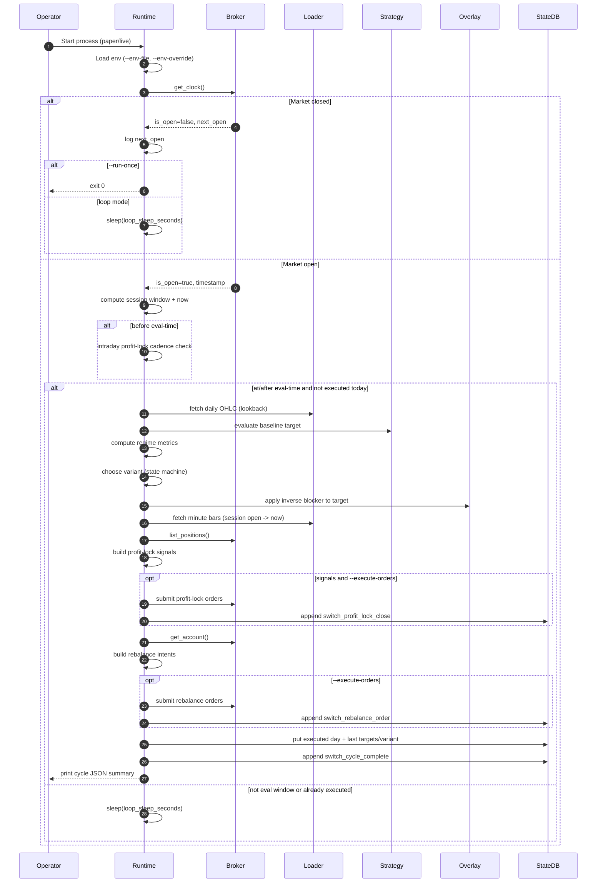
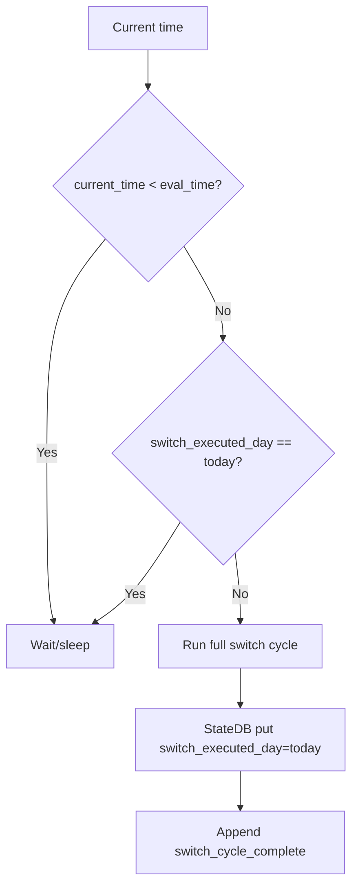
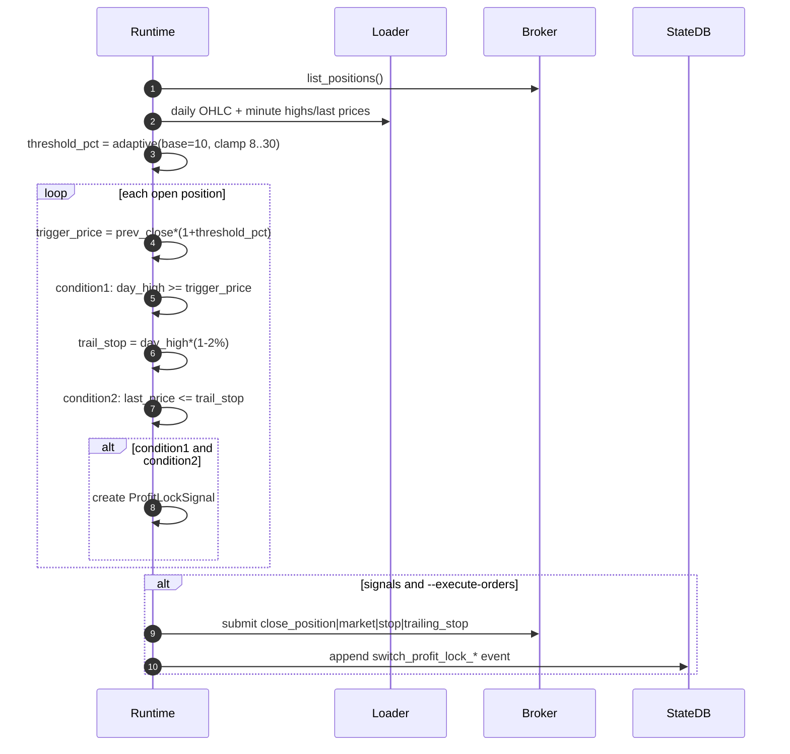
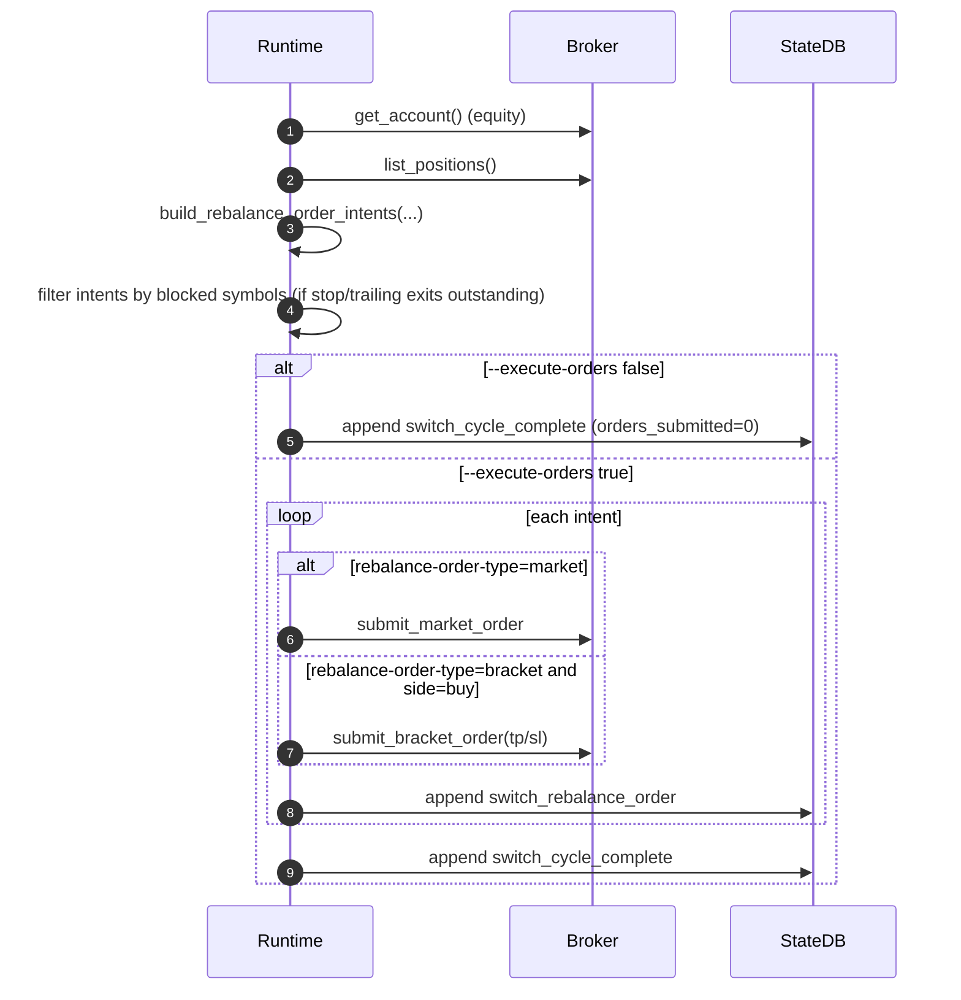

# Switch Runtime V1 Sequence Diagrams

## 1) Scope
This companion document explains runtime execution order, timing, state writes, and emitted events for:
- `/home/chewy/projects/trading-compose-dev/switch_runtime_v1/runtime_switch_loop.py`

It is designed to be read together with:
- `/home/chewy/projects/trading-compose-dev/switch_runtime_v1/docs/SWITCH_RUNTIME_V1_PAPER_LIVE_GUIDE.md`

## 2) Participants
- `Operator`: user/process launching runtime.
- `Runtime`: `runtime_switch_loop.py` main loop.
- `StateDB`: `switch_runtime_v1_runtime.db` via `StateStore`.
- `Broker`: `AlpacaBroker` (clock, account, positions, orders).
- `Loader`: `AlpacaBarLoader` (daily + minute bars).
- `Strategy`: `evaluate_strategy(...)` base evaluator.
- `Overlay`: inverse-blocker overlay application.

## 3) Daily Timeline (NY Time)
- 09:30 market opens.
- 09:30 to `--eval-time` (default 15:55):
  - intraday profit-lock checks every `intraday_profit_lock_check_minutes` (current profile: 5 min).
- At/after `--eval-time` once per day:
  - full switch cycle (variant decision + rebalance).
- Guard:
  - `switch_executed_day` prevents duplicate daily cycle.

## 4) Main Runtime Loop


## 5) Intraday Profit-Lock Sub-Loop (5-minute cadence)
```mermaid
flowchart TD
    A[Market open and now < eval-time] --> B{profile.enable_profit_lock and check_minutes > 0}
    B -->|No| Z[Skip intraday check]
    B -->|Yes| C[Compute slot_idx = floor((hour*60 + minute)/check_minutes)]
    C --> D[slot_key = YYYY-MM-DD:slot_idx]
    D --> E{slot_key equals last stored slot?}
    E -->|Yes| Z
    E -->|No| F[Fetch daily OHLC + minute day stats]
    F --> G{stale data <= threshold and enough symbols?}
    G -->|No| H[Store last slot only]
    G -->|Yes| I[Compute adaptive threshold]
    I --> J[Build profit-lock signals per open position]
    J --> K{signals present and --execute-orders?}
    K -->|No| H
    K -->|Yes| L[Submit profit-lock order type]
    L --> M[Append switch_profit_lock_intraday_close events]
    M --> H
    H --> N[StateDB put switch_intraday_profit_lock_last_slot]
```

## 6) Exact Slot-Key Behavior
Formula used:
- `slot_idx = floor((hour*60 + minute) / intraday_profit_lock_check_minutes)`
- `slot_key = "{YYYY-MM-DD}:{slot_idx}"`

Current profile value:
- `intraday_profit_lock_check_minutes = 5`

Examples:
- 09:30 -> minute `570`, `slot_idx=114`, key like `2026-03-23:114`
- 09:34 -> still `slot_idx=114`
- 09:35 -> `slot_idx=115`

Effect:
- At most one intraday profit-lock execution attempt per slot.

## 7) Daily Eval-Time Cycle Gate


## 8) Variant State Machine

```mermaid
stateDiagram-v2
    [*] --> baseline

    baseline --> inverse_ma20: rule2 true for 3d
    baseline --> inverse_ma60: rule3 true for 3d

    inverse_ma20 --> inverse_ma60: rule2 false 3d AND rule3 true 3d
    inverse_ma60 --> inverse_ma20: rule2 true 3d

    baseline --> baseline: rule1 risk/chop gate
    inverse_ma20 --> baseline: rule1 risk/chop gate
    inverse_ma60 --> baseline: rule1 risk/chop gate

    baseline --> baseline: dd20>=12 force 5 days
    inverse_ma20 --> baseline: dd20>=12 force 5 days
    inverse_ma60 --> baseline: dd20>=12 force 5 days

    baseline --> baseline: high_vol_lock (rv20>=1.35; unlock <1.20)
    inverse_ma20 --> baseline: high_vol_lock
    inverse_ma60 --> baseline: high_vol_lock
```


## 9) Profit-Lock Decision Sequence


## 10) Rebalance Order Sequence


## 11) State Write Ordering (Per Main Daily Cycle)
1. Optional: `switch_variant_changed` event.
2. `switch_regime_state` key update.
3. Optional: profit-lock events (`switch_profit_lock_close`).
4. Optional: `switch_rebalance_order` events.
5. `switch_executed_day` key update.
6. `switch_last_profile`, `switch_last_variant`.
7. `switch_last_baseline_target`, `switch_last_final_target`.
8. `switch_cycle_complete` event.

## 12) Event Payload Quick Reference
### `switch_variant_changed`
- `ts`, `from`, `to`, `reason`

### `switch_profit_lock_intraday_close` / `switch_profit_lock_close`
- `ts`, `symbol`, `qty`, `profile`, `threshold_pct`
- `profit_lock_order_type`, `trigger_price`, `trail_stop_price`, `last_price`
- `cancelled_open_orders`
- plus intraday context (`intraday_slot`) for intraday event

### `switch_rebalance_order`
- `ts`, `symbol`, `side`, `qty`, `target_weight`
- `profile`, `variant`, `order_type`
- `take_profit_price`, `stop_loss_price`

### `switch_cycle_complete`
- `ts`, `day`, `profile`
- `variant`, `variant_reason`, `inverse_note`
- `threshold_pct`
- `profit_lock_closed_symbols`
- `profit_lock_order_type`, `rebalance_order_type`
- `intent_count`, `orders_submitted`, `execute_orders`
- `regime_metrics` (when available)

## 13) Runtime Modes and Expected Output
- `--run-once` + market closed:
  - expected output: market closed + next open
  - exits without trading
- `--run-once` + market open before eval-time:
  - intraday checks may run one slot
  - no daily cycle until eval-time reached
- continuous loop without `--run-once`:
  - intraday checks all session
  - one daily cycle at/after eval-time

## 14) Practical Interpretation
- This runtime is a live/paper execution loop, not a pure synthetic backtester.
- For expectation setting:
  - optimistic backtests = upper bound
  - realistic backtests = closer proxy to live/paper
- actual broker results can still differ due to fills, spread, queue position, latency, and partial fills.
